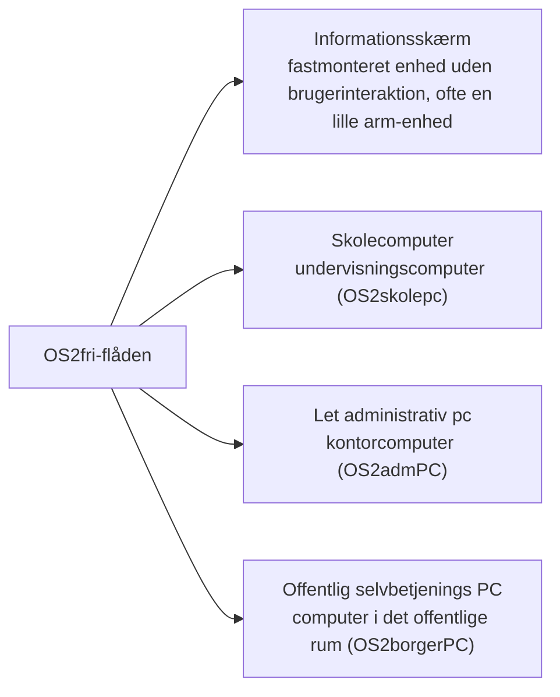

# Teknologiafdækning
_Afdækning og rationale for valg af bootc teknologien til at understøtte OS2fri's programmets flådestyring._

## Introduktion

Afdækningen viser hvilket teknologivalg der er det bedste strategiske valg til at understøtte OS2fri's programmets flådestyring. Valget favoriserer den teknologi, der leverer bedst på de fire identificerede metoder der løser de opstillede generelle myndigheds og drifts krav.

Det giver et flådestyringssystem, der opfylder de generelle højniveau-krav, majoriteten af driftsafdelinger opstiller:

|  |  |  |
|:---:|:---:|:---:|
|   |   |   |
| ✓ Pålidelighed | ◎ Forudsigelighed | ⛨︎ Sikkerhed |
|   |   |   |
| ⚙︎ Effektiv drift | ⚖︎ Efterlevelse af lovgivning | ∞ Driftskontinuitet |


### Anbefaling

**Anbefalingen er at gå videre med bootc.** En kommende beslutning (ADR) skal tage stilling til:

- valg af fleet-orchestrator — det lag, der fører enhederne mod billedet,
- valg af base image (RHEL image mode, CentOS Stream eller Fedora),
- policy for genstart, da en opdatering aktiveres ved genstart,
- strategi for app-laget (hvordan programmer og pakker håndteres).

Argumentationen bag anbefalingen findes i afsnittene om [fordele](#fordele---hvorfor-bootc-er-det-bedste-strategiske-fit) og [ulemper og risici](#ulemper-og-risici).

## Behovsafdækning
_Driftsafdelinger formulerer sjældent nedskrevne tekniske krav — de oplever hvad de har brug for gennem hverdagens friktion. Samlet set stiller myndighedernes drift erfaringsmæssigt et lille antal **højniveau-krav** til et flådestyringssystem._

_For hvert krav angives de **metoder**, der kan levere på disse. Hvilke **teknologier** der kan anvendes til at implementere metoderne, vurderes i afsnittene om fordele og ulemper._

### Højniveau-krav
---

#### ✓ **Pålidelighed** — _"Enhederne skal bare virke"_

Elever, borgere og medarbejdere forventer, at enhederne er tændte, opdaterede og velfungerende hver eneste dag, ideelt set uden at nogen skal røre dem.

  - **Operationelle krav:** Flådestyringen skal vedligeholde enhederne af sig selv; maskinerne skal ikke kræve løbende manuel opmærksomhed.
  - **Metoder der leverer:** Automatiske og kontrollerede opdateringer; hurtig gendannelse og tilbagerulning af fejl; ensartede enheder uden afvigelser; ensartet overvågning.

---

#### ◎ **Forudsigelighed** — _"Hvorfor fejler maskinen? Hvem har pillet ved konfigurationen sidst?"_

Ændringer laves i fag ofte fejlagtigt direkte på enkelte enheder og bliver sjældent dokumenteret, gennemgået eller udbredt til resten af flåden — så når en enhed fejler, kan ingen svare på, hvem der ændrede hvad eller hvornår. Flådens tilstand bliver dermed uforudsigelig.

  - **Operationelle krav:** Flådens tilstand skal til enhver tid kunne forklares og forudsiges: kun godkendte og dokumenterede ændringer udrulles, og hver ændring kan knyttes til en bestilling eller en beslutning.
  - **Metoder der leverer:** Ændringsstyring efter det klassiske ITIL-rammeværk — ændrings-anmodninger, hvor en ændring foreslås, gennemgås, godkendes og flettes ind, før den udrulles til flåden, så ændringer aldrig kommer uventet.

---

#### ⛨︎ **Sikkerhed** — _"Hvis en enhed angribes, skal vi kunne håndtere det — hurtigt og effektivt! Optimalt uden at skulle være fysisk til stede ved maskinen."_

Sårbarheder skal håndteres proaktivt, og det skal undgåes at de påvirker hele flåden. Hvis en enhed alligevel rammes skal enheden hurtigt hurtigt og automatisk bringes tilbage i en sikker, godkendt standard tilstand.

  - **Operationelle krav:** Enhederne skal opdatere sig selv hurtigt og ensartet, så kendte sårbarheder lukkes proaktivt — og det skal være tæt på umuligt at ændre på selve systemet, også hvis en ondsindet aktør får adgang til en enhed.
  - **Metoder der leverer:** Hurtig og ensartet opdatering af hele flåden; systemkerne der i praksis ikke kan manipuleres fra enheden; løbende sikkerhedsrapportering.

---

#### ⚙︎ **Effektiv drift** — _"Vi er få mennesker til mange maskiner."_

Manuelt arbejde per enhed skalerer ikke, hvis flåden vokser. Driften har brug for, at rutineopgaverne klares automatisk uden manuel indgriben, så de sparsomme menneskelige ressourcer bruges, på at levere ny værdi mere effektivt.

  - **Operationelle krav:** Rutineopgaver (konfiguration, opdatering, overvågning) skal klares automatisk uden krav om manuelt per-enhed arbejde.
  - **Metoder der leverer:** Automatiseret og centralt styret vedligehold; Ændringer forankres i godkendte tilstande for hele flåden;
---

#### ⚖︎ **Lovgivningsmæssig efterlevelse** — _"Vi skal kunne redegøre for vores systemer."_

NIS2, GDPR og it-revision kræver, at man kan vise, hvad der er ændret, hvornår og af hvem — og at ændringerne er afprøvet, før de rammer enhederne i drift.

  - **Operationelle krav:** Sporbarhed og revisionsdata skal være et naturligt biprodukt af al administration, så efterlevelse bliver billig og enkel.
  - **Metoder der leverer:** Sporbar historik og revision som et naturligt biprodukt af al administration; konsistent dokumentation.

---

#### ∞ **Driftskontinuitet** — _"Vi er afhængige af kontinuerlig drift — også ved uventede eksterne hændelser: aftaleophør, opkøb, licensændringer eller nye ejere af platformen."_

Flådestyringen skal kunne fortsætte, uanset hvad der sker omkring den: leverandøren kan ophøre, blive opkøbt, ændre licenser eller priser, og hosting kan skifte hænder. Løsningen må derfor ikke afhænge af én leverandør eller ét lukket system — kommunerne skal beholde kontrollen over egne systemer og data.

  - **Operationelle krav:** Systemet skal kunne fortsætte og skifte hænder uden afbrydelse: hele stacken skal kunne genskabes og flyttes til en ny leverandør eller hosting uden at miste data, konfiguration eller funktionalitet.
  - **Metoder der leverer:** Leverandøruafhængighed: åbne standarder og formater; ingen proprietære bindinger. Hele stacken (kode, deployments, konfiguration) beskrevet åbent og versionsstyret i git, så systemet kan genopbygges og flyttes.

---

### **Metoder der leverer på krav**

På tværs af kravene går fire metoder igen, der tilsammen kan håndtere dem:

1. **Godkendt tilstand beskrevet ét sted** — flådens godkendte tilstand ligger som tekst i et versionsstyret depot (Pålidelighed, Effektiv drift, Lovgivningsmæssig efterlevelse, Driftskontinuitet).
2. **Automatisk afstemning** — enhederne føres automatisk til den beskrevne tilstand og holdes der (Pålidelighed, Effektiv drift, Lovgivningsmæssig efterlevelse, Driftskontinuitet).
3. **Sporbar historik og tilbagerulning** — alle ændringer føres i historik, kan føres tilbage til en beslutning og rulles tilbage (Forudsigelighed, Sikkerhed, Lovgivningsmæssig efterlevelse, Driftskontinuitet).
4. **Gennemgang og godkendelse af ændringer** — ingen ændring rammer flåden uventet; alt foreslås, gennemgås og godkendes først (Forudsigelighed).

Set samlet leveres alle fire metoder af de standardiserede best practices, der er samlet under [OpenGitOps](https://www.cncf.io/projects/opengitops/).

Én metode er særlig krævende: ændringsstyringen (Forudsigelighed) lever kun fuldt ud, hvis den også gælder selve styresystemet — at OS'et kun kan ændres gennem den godkendte pipeline. Det er netop her, bootc skiller sig ud, som de følgende afsnit viser.

## Fordele — hvorfor bootc er det bedste strategiske fit

For hver af de fire metoder beskrives her, hvordan bootc leverer på den — og dermed på de krav, metoden er knyttet til.

### Godkendt tilstand beskrevet ét sted

_leverer på: Pålidelighed, Effektiv drift, Lovgivningsmæssig efterlevelse, Driftskontinuitet_

Flådens godkendte OS-tilstand er ét billede i et OCI-registry. Billedet bygges fra en tekstbeskrivelse i et versionsstyret depot — ét sted at se den godkendte tilstand, og ét sted at ændre den. Enhederne booter billedet; der er ingen anden "sandhed" om, hvordan OS'et skal se ud, end det, der ligger i registryet. Afvigelser kan opdages, fordi enheden kan sammenlignes med billedet.

### Automatisk afstemning

_leverer på: Pålidelighed, Effektiv drift, Lovgivningsmæssig efterlevelse, Driftskontinuitet_

Enhederne føres automatisk mod det godkendte billede og holdes der — også efter fejl, geninstallering eller manuel indgriben. Driften kan lade rutineopgaverne køre af sig selv: hvis en enhed falder ud af den godkendte tilstand, bringes den tilbage til den, uden at nogen skal på besøg.

### Sporbar historik og tilbagerulning

_leverer på: Forudsigelighed, Sikkerhed, Lovgivningsmæssig efterlevelse, Driftskontinuitet_

Hvert billede er uforanderligt og har en historik: hvad der er ændret, hvornår og af hvem. Rollback er et billede-skift — enheden peges tilbage på et tidligere, kendt billede og genstartes. Det giver hurtig gendannelse og nulstilling af en ramt enhed, uden at nogen skal være fysisk til stede, og revisionsdata bliver et naturligt biprodukt.

### Gennemgang og godkendelse af ændringer

_leverer på: Forudsigelighed_

Et nyt billede produceres gennem en kontrolleret pipeline: forslag (pull request) → byg → signer → godkendelse → udrulning. Og afgørende: fordi bootc gør selve systemkernen i praksis umulig at ændre fra enheden, gælder ændringsstyringen også OS'et selv. Ingen kan pille ved konfigurationen på en enkelt maskine — det svarer direkte på spørgsmålet "hvem har pillet ved konfigurationen sidst?"

### Derudover leverer bootc på de øvrige krav

**Driftskontinuitet** — hele stacken er åben og versionsstyret i git, og billederne ligger i et selv-hostet registry (fx Forgejo) efter en åben standard (OCI). Systemet kan derfor genopbygges, flyttes og skifte leverandør eller hosting uden at miste data, konfiguration eller funktionalitet — uanset aftaleophør, opkøb eller licensændringer.

**Sikkerhed** — opdateringer trækkes af enheden (download-only) og kan signeres; et indbrud i én enhed kan ikke bruges til at ændre systemet, og en ramt enhed genoprettes ved at pege på et godkendt billede.

**Effektiv drift** — billedet erstatter manuel installation og konfiguration pr. enhed; en ny version udrulles til hele flåden på én gang.

**Modenhed og økosystem** — bootc understøttes af Red Hat (RHEL image mode), CentOS Stream og Fedora, og der findes open source-fleet-controllere (fx bootc-fleet-controller) i det bredere GitOps-økosystem under CNCF.

**Kompetencer** — metoden bygger på git, pull requests og billede-/container-kendskab, som i forvejen findes i OS2fri-projekterne, frem for en proprietær konsol eller agent-teknologi.

## Ulemper og risici

En grundig vurdering skal også forholde sig til, hvor bootc ikke leverer gratis:

- **Opdateringer aktiveres ved genstart.** En enhed skal genstartes, før et nyt billede tages i brug. Det kræver en policy for, hvornår og hvordan genstart sker (fx uden for arbejdstid) — særligt for informationsskærme.
- **Afhængighed af en orchestrator.** Afstemningen mod billedet leveres af en fleet-controller eller anden orchestrator. bootc beskriver _hvad_ tilstanden skal være; et eksternt lag sørger for, at den bliver det. Valg og drift af dette lag bliver en del af løsningen.
- **Base image er en de facto distro-binding.** Billeder bygges i praksis på RHEL image mode, CentOS Stream eller Fedora — man binder sig til en distro-familie og dens release-rytme.
- **App-laget.** Programmer og lokale pakker skal bygges ind i billedet eller køre containeriseret; klassisk "installer pakken på enheden" passer ikke med modellen.
- **Modenhed på arm.** Understøttelse og test på arm (fx Raspberry Pi) er yngre og mindre udbredt end på x86.
- **Omstillingsomkostning.** Driften skifter fra "enhed pr. enhed" til "billede og versioner" — en metodeomstilling, ikke kun et værktøjsskift.

## Hvorfor ikke alternativerne

**Klassisk konfigurationsstyring (fx Ansible + traditionel pakkehåndtering)** kan udrulle konfiguration og pakker pr. enhed, men enhederne forbliver individuelle: der er ingen samlet godkendt tilstand for selve OS'et, ingen billed-historik og ingen hurtig rollback af hele systemet. Ændringsstyringen gælder ikke systemkernen, og en afvigende enhed kan kun bringes tilbage ved geninstallering.

**Tyndt billede + konfigurationsstyring ovenpå** er bedre, men afvigelser akkumuleres over tid ("snowflake-enheder"), og både forudsigelighed og rollback svækkes i forhold til et samlet billede.

De fire metoder leveres derfor kun fuldt ud af en image-baseret model, hvor selve OS'et er ændringsartefaktet — og det er netop bootc's model.

## Konklusion og vejen videre

Bootc leverer de fire metoder, som afdækningen viser dækker kravene til flådestyring — og styrker samtidig de krav, der er sværest at opfylde i dag: forudsigelighed, sikkerhed og driftskontinuitet. Anbefalingen er at gå videre med bootc som grundlag for OS2fri's fleet management.

En kommende beslutning (ADR) skal forholde sig til:

1. valg af fleet-orchestrator og dens driftsmodel,
2. valg af base image (RHEL image mode, CentOS Stream eller Fedora),
3. policy for genstart ved opdatering,
4. strategi for app-laget,
5. håndtering af arm-baseret hardware.

---

## Bilag A — Terminologi

Begreber anvendes i overensstemmelse med den fælles begrebsfil **`docs/begreber.md`**, der etableres via [issue #14](https://github.com/OS2sandbox/os2fri-dokumentation/issues/14) ("Afgrænsning af flertydige begreber").

Begrebsfilen fastlægger et fælles, teknologineutralt begrebssæt, så begreber som fx _enhed_, _flåde_, _base image_ og _opdatering_ betyder det samme på tværs af OS2fri-projekterne, uanset teknologivalg.

## Bilag B — Enhedstyper og livscyklus

Afdækningen dækker de enhedstyper, OS2fri forventes at administrere, og de livscyklusfaser en flådeadministreret enhed gennemgår. Evalueringen vurderer bootc mod hele livscyklussen — ikke kun en enkelt fase.

**Enhedstyper**



**Livscyklusfaser**

```mermaid
stateDiagram-v2
    direction LR
    [*] --> Initialisering
    Initialisering --> Klargøring
    Klargøring --> "Løbende opdateringer"
    "Løbende opdateringer" --> Overvågning
    Overvågning --> Afvikling
    Afvikling --> [*]
```

Faserne initialisering, løbende opdateringer og overvågning er de mest kritiske for en flådeadministreret enhed og får tilsvarende vægt i vurderingen.
