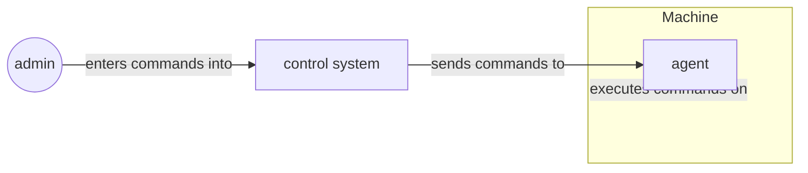
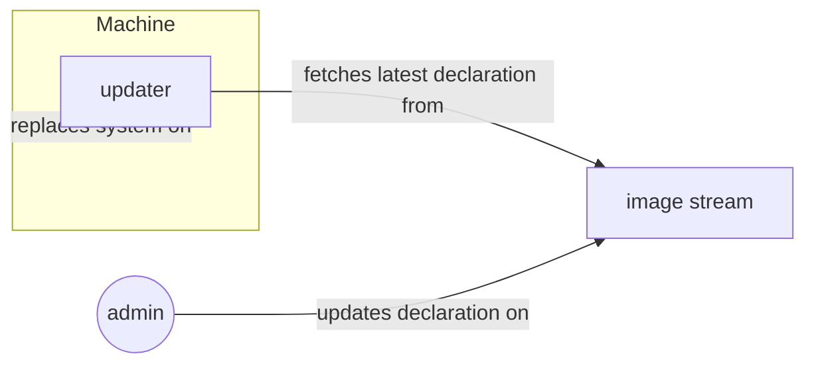
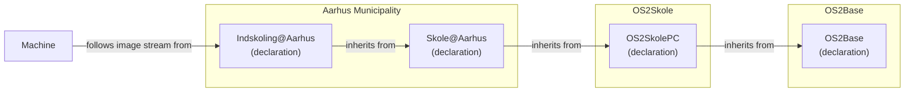
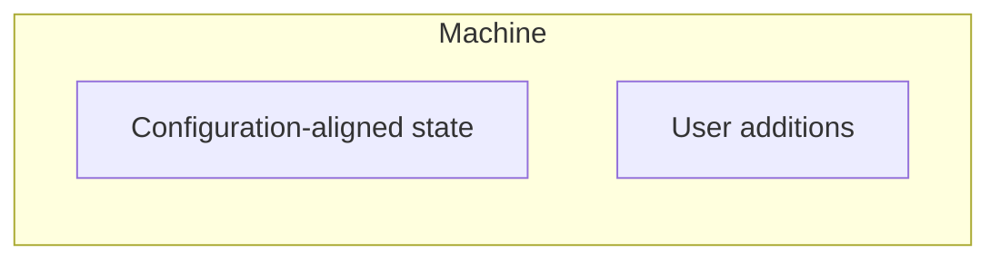
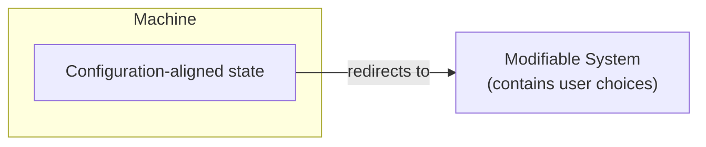
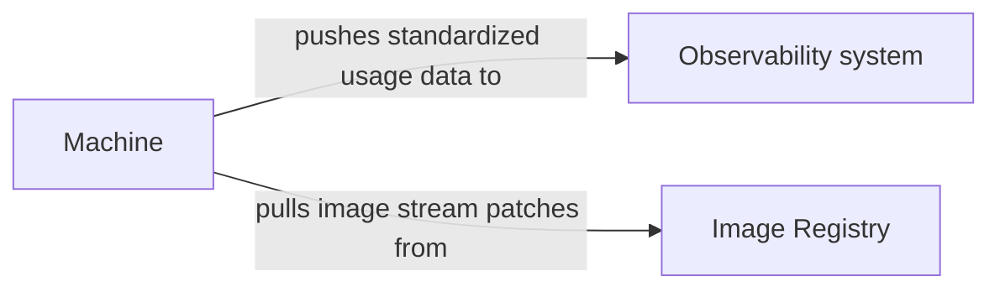
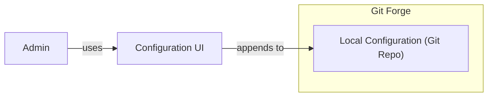
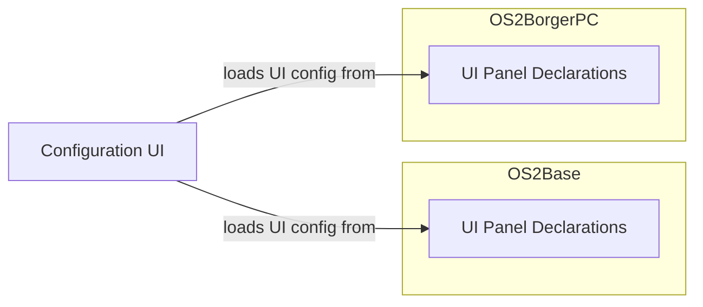
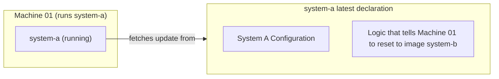
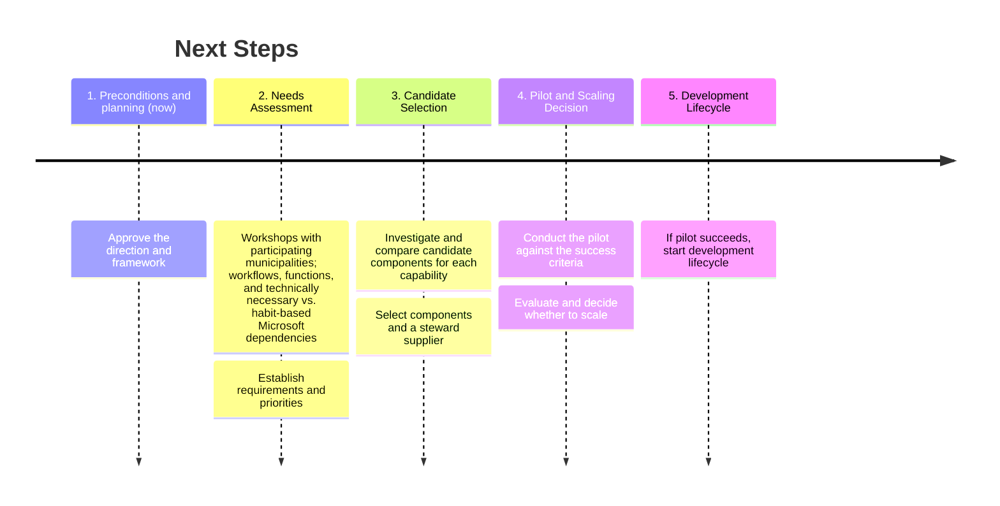

# The Need for Fleet Management

## Needs Assessment

Administrators and operations departments rarely formulate written technical requirements—they experience them through the friction of everyday work. This includes the fundamental challenges of managing many decentralized devices with few people available to perform the work. Based on this, we describe hypotheses on the needs of administrators and operations departments and establish a set of high-level requirements (R1–R6) and methods (M1–M4).
These high-level requirements and methods are technology-neutral: they remain valid regardless of the technology used.

### High-Level Requirements

---

#### ✓ R1: Reliability

_"The devices should just work."_

> Students, citizens, and employees expect devices to be powered on, up to date, and functioning properly every day—ideally without anyone having to touch them.

**Operational requirements**

> Fleet management must maintain the devices automatically. The devices must not require ongoing manual attention.

##### Methods that deliver

- **M1 Approved state described in one place**: consistent devices without deviations
- **M2 Automatic reconciliation**: automatic and controlled updates; consistent monitoring
- **M3 Traceable history and rollback**: rapid recovery and rollback of errors

#### ◎ R2: Predictability

_"Why is the machine failing? Who last changed the configuration?"_

> Changes are traditionally made directly on individual devices or groups and are rarely documented or reviewed before being deployed. Consequently, when a device fails, no one can explain who changed what or when. In some cases, fixes are also mistakenly not propagated to every device in the fleet.

> The state of the fleet therefore becomes **unpredictable.**

**Operational requirements**

> It must always be possible to explain and predict the state of the fleet: only approved and documented changes are rolled out, and every change can be linked to a request or decision.

##### Methods that deliver

- **M3 Traceable history and rollback**: a traceable history that allows every change to be traced back to a decision
- **M4 Review and approval of changes**: change management in accordance with the traditional ITIL framework: a change is proposed, reviewed, approved, and merged before being rolled out to the fleet, ensuring that changes are never unexpected

---

#### ⛨︎ R3: Security

_"If a device is attacked, we need to be able to handle it—quickly and effectively. Ideally without having to be physically present at the machine."_

> Vulnerabilities must be addressed early and preferably proactively. They should be prevented from affecting the entire fleet, but if a device is nevertheless compromised, it must be possible to return it quickly and automatically to a secure, approved standard state.

**Operational requirements**

> Devices must update themselves quickly and consistently so that known vulnerabilities are closed proactively—and changing the system itself must be close to impossible, even if a malicious actor gains access to a device.

##### Methods that deliver

- **M1 Approved state described in one place**: a system core that, in practice, cannot be manipulated from the device
- **M2 Automatic reconciliation**: rapid and consistent updates across the entire fleet; continuous security reporting
- **M3 Traceable history and rollback**: rapid restoration of affected devices to the approved standard state

---

#### ⚙︎ R4: Efficient Operations

_"We have few people and many machines."_

> Manual work on each device does not scale as the fleet grows. Operations teams need routine tasks to be handled automatically without manual intervention, allowing scarce human resources to be used more effectively to deliver new value.

**Operational requirements**

> Routine tasks—configuration, updates, and monitoring—must be performed automatically without requiring manual work on each device.

##### Methods that deliver

- **M1 Approved state described in one place**: changes are anchored in approved states for the entire fleet
- **M2 Automatic reconciliation**: automated and centrally managed maintenance

---

#### ⚖︎ R5: Regulatory Compliance

_"We need to be able to account for our systems."_

> NIS2, GDPR, and IT audits require organizations to demonstrate what was changed, when it was changed, and by whom—and that changes were tested before reaching devices in production.

**Operational requirements**

> Traceability and audit data must be a natural by-product of all administration, making compliance inexpensive and straightforward.

##### Methods that deliver

- **M1 Approved state described in one place**: consistent documentation
- **M3 Traceable history and rollback**: traceable history and auditing as a natural by-product of all administration
- **M4 Review and approval of changes**: approval before a change reaches the fleet

---

#### ∞ R6: Operational Continuity

_"We depend on continuous operation—even in the event of unexpected external developments such as contract termination, acquisitions, licensing changes, or new owners of the platform."_

> Fleet management must be able to continue regardless of what happens around it: the supplier may cease operations, be acquired, or change its licenses or prices, and hosting may change hands. The solution must therefore not depend on a single supplier or closed system—the municipalities must retain control over their own systems and data.

**Operational requirements**

> The system must be able to continue operating and change hands without interruption: the entire stack must be reproducible and transferable to a new supplier or hosting provider without losing data, configuration, or functionality.

##### Methods that deliver

- **M1 Approved state described in one place**: the entire stack (code, deployments, and configuration) is described openly and version-controlled in Git, allowing the system to be rebuilt and moved
- **M3 Traceable history and rollback**: supplier independence through open standards and formats without proprietary lock-in

## Overview of Requirements and Methods

Four recurring methods collectively address all the identified scenarios and needs.

### M1: Approved State Described in One Place

The fleet's approved state is stored as text in a version-controlled repository.

- **Delivers on:** R1 Reliability · R3 Security · R4 Efficient operations · R5 Regulatory compliance · R6 Operational continuity.

### M2: Automatic Reconciliation

Devices are automatically brought into the described state and kept there.

- **Delivers on:** R1 Reliability · R3 Security · R4 Efficient operations.

### M3: Traceable History and Rollback

All changes are recorded in the history, can be traced back to a decision, and can be rolled back.

- **Delivers on:** R1 Reliability · R2 Predictability · R3 Security · R5 Regulatory compliance · R6 Operational continuity.

### M4: Review and Approval of Changes

No change reaches the fleet unexpectedly; everything is proposed, reviewed, and approved first.

- **Delivers on:** R2 Predictability · R5 Regulatory compliance.

Taken together, all four methods are provided by the standardized best practices collected under [OpenGitOps](https://www.cncf.io/projects/opengitops/).

One method is particularly demanding: change management (R2 Predictability) is only fully effective if it also applies to the operating system itself—meaning that the OS can only be changed through the approved pipeline.

---

## General Strategic Principles

We recommend that the OS2fri programme follow these principles. This way, it can ensure a robust, future-proof solution.

### ∞ R7: Maximize Resources Through Reuse

In order to maximize the resources used to deliver value to public authorities, we recommend:

- Follow recognized architectural standards and principles.
- Reuse recognized standard metrics for viability and security before deciding whether to reuse technologies.
- Avoid maintaining home-grown infrastructure solutions where an international standard already exists.
- Seek out international suppliers, especially in areas where Danish expertise is rare.

### ፠ R8: Digital Sovereignty and Ownership by Design

To be prepared for external changes that may affect the operational continuity of the OS2fri programme, we recommend:

- Every part of the solution—from documentation, source code, deployment manifests, and templates to the task management that defines the delivery—must be transparent, managed, and owned by the OS2 authorities themselves.
- Take ownership of the systems that store and manage information related to the OS2fri programme.

# Fleet Management Analysis

## Feasibility of (Declarative) Fleet Management

All OS2fri projects share the challenge of solving this problem: "I want to set up a fleet of devices that all share the same or similar software configurations."

How this problem is solved is crucial for the risks that need to be analyzed, as well as the decision making on potential solutions.

OS2fri must decide early: How do we get the machines to achieve the desired state?

### Pattern A: Agent as the Admin's "Extended Hand"

In this pattern, a machine agent serves as the administrator's "extended hand" and runs code decided on by a central, administrator-controlled system.

---

### Pattern B: Standardized Declarations

In this pattern, a desired machine state for a whole fleet of machines is defined. The machine is pointed at the right machine state channel, and then keeps itself up to date with the machine state channel.

We hypothesize that a design based on Pattern B, Standardized Declarations, is more suitable for OS2fri's use case.

**Why?** Reliability, Security, Efficient Operations, Regulatory Compliance, Operational Continuity

- Only the "Standardized Declarations" pattern strictly guarantees that there is an approved system state described in a single location (a single source of truth) → Delivers on Reliability, Security, Efficient Operations, Regulatory Compliance, and Operational Continuity.

With Standardized Declarations, we can, by design, reduce the risk of the following events:

- Machines beginning to deviate slightly ("drift") from one another, with only the person who made the change understanding how.
- Undocumented changes to some machines causing update compatibility problems.
- Unauthorized actors compromising the all-powerful actor and making dangerous changes to the system.
- Knowledge of how systems work being lost when municipalities change suppliers or key employees change jobs.

And we can help ensure:

- Every machine to be returnable to its desired state.
- It becomes easy to document which software runs on the fleet and how it is configured.

At first glance, Pattern A seems well suited to support the needs of OS2fri. Nonetheless, because of these advantages, we investigated the consequences of extending Pattern B (Standardized Declarations) into a design that solves some of the problems relevant to OS2fri, where interactions with individual machines are required.

## Note on Problem Speculations

Rather than replicating an existing solution one-to-one, a software system like OS2fri should be designed to solve specific problems.
During the design process for OS2fri, one Product Owner of a related project was part of the team, but otherwise we were not able to talk to the actual participants of the system. For example, we do not yet fully understand the administrative employees' actual workflows, priorities, and habits.
Therefore, we are _speculating_ about which problems are important enough to discuss here.

During actual development, we strongly suggest that user representatives be included, so that the actual problems can be investigated and prioritized. (See "Next Steps" section for reference.)

## Standardized Declarations Risks

While envisioning OS2Base following the Standardized Declarations design, the following problem types appeared potentially challenging. We therefore decided to analyze early whether they can be solved within this design:

- The trade-off between system restrictions and end-user needs
- The need to observe the state of the fleet
- The ease of use that we need administrators to experience with the system
- Remotely changing the setup of specific devices rather than the entire fleet

---

### Problem Type: Restricted Systems vs. End-user Needs

We hypothesize that the following experiences will be desired:

🧑‍💻 "I can't write a system declaration for every single employee at city hall, so I'm going to write one declaration that should work for everyone."  
👸 "I'm curious about trying a vector graphics editor in my workflow. Hopefully, I can simply install and try a program like that without it turning into a major bureaucratic process."

Actors: 👸 End User  - 🧑‍💻 Admin

---

#### Solution Design

Example: Early-years school PC at Aarhus Municipality:

---

To avoid ending up with one declaration per machine:

##### Addition Pattern

The administrator may allow the end user to _extend_ their existing software system. However, the end user is never allowed to _remove_ or _modify_ parts of the configuration-aligned state.

For example: User: "I want to be able to install software that is relevant to my use case."  
Solution: Provide a list of applications that may be installed on the system. These applications must not change any of the parameters on which the administrator relies (existing sandboxing solutions can provide this).

##### Reference Pattern

Another example: User: "I want to be able to use the correct printer at my office."  
Solution: Make the system agnostic about the specific printer used by a user. Every machine has access to a long list of printers, with permissions enforced at the printer or network level.

---

### Problem: How Do We Know the State of the Fleet?

We hypothesize that the following experiences will be desired:

👸 "Ouch, the computer at the library just crashed! Hopefully, someone is notified quickly."  
👩‍💼 "Someone set up a fake Wi-Fi network at our office! Fortunately, I can check which networks the office machines have connected to."  
🧑‍💻 "After our latest update, some people have complained about printer connectivity issues. To determine what is wrong, I really need to see which errors people are encountering on their computers."

Actors: 👸 End User  - 🧑‍💻 Admin  - 👩‍💼 CISO

---

#### Solution Design

- Each machine exposes standardized observability data.
- A central observability system collects all this data.
- Observability data is converted into a standardized format.

The information flow then becomes:

Required machine components:

- Machine Data Collector (a component that collects machine behavior, converts it into the standardized usage-data format, and sends it to the observability system)
- Update Checker (a component that regularly checks for new image patches, downloads them, and applies them to the machine)

---

### Problem: Seamless Configuration Experience

We hypothesize that the following experiences will be desired:

🧑‍💻 "When I want to change the fleet configuration, I know I can find the correct setting in the configuration interface. It is my one-stop shop for any kind of configuration."  
🧑‍💻 "I'm sure they use all kinds of complicated technology to make this system work, but fortunately I don't need to learn any of it to change the configuration."  
👩‍💼 "Some software was recently installed on the fleet, and I did not really know why it was there. Fortunately, I could easily check who added the configuration, who approved it, and when the change was made."  
👩‍💼 "I want to ensure that none of my employees can change the fleet configuration without someone else reviewing the change."

Actors: 🧑‍💻 Admin  - 👩‍💼 CISO

---

#### Solution Design

- Configuration management is based on an existing VCS solution such as Git. **Why?** This gives us traceable history, rollback, and review and approval of changes at no additional cost.
- As part of OS2fri, a thin layer is created on top of Git to make configuration easier for local administrators.
- OS2Base provides the UI logic for the configuration interface and investigates the appropriate visual and user-experience design language.
- The UI logic converts a standardized intermediate format into a UI.
- Individual OS2fri products expose configuration items in the standardized intermediate format.

Making the Configuration UI seamless across project boundaries:

---

### Problem: Remote System Configuration Changes

We hypothesize that the following experiences will be desired:

🧑‍💻 "Machines 100 through 110 are following the 'children's library' channel, but they should all be on the 'adult library' channel now. I can make this change without having to visit the location."  
🧑‍💻 "When the school year ends, I can easily reset all student machines to their default state so they are ready for new students the following year." ("Powerwash")

Actors: 🧑‍💻 Admin

---

#### Solution Design

**Important:** If the "remote" requirement is less strict, other designs are preferable to this one.

Specific manipulation pathways must be investigated in advance, after which logic for those manipulations is added to the system.

Because a particular system only ever retrieves the same configuration as other systems, the problems can be solved as follows:

- Specific manipulation paths are preconfigured in the image.
- With every image update, all machines download a list containing the IDs of the machines to which the manipulation must be applied.
- This means that every machine has a unique, immutable identifier.

**Important:** Changes to individual machines only move the machine to the state of a known, approved image stream.

# Next Steps

## Process-related Risks and Mitigations

### Risk 1: Target-state agreements assume direct one-to-one functionality

- **Consequence:** Misallocated resources and failure to deliver
- **Mitigation:** Task-based success criterion: "Can users perform the same piece of work?"

### Risk 2: Funds spent exclusively on user-facing functionality

- **Consequence:** Lock-in to a new single supplier without an exit strategy
- **Mitigation:** Steward contract, sovereign forge, and task-based success criteria from the outset

### Risk 3: Unknown user needs determine component selection

- **Consequence:** Incorrect priorities and costly reselection
- **Mitigation:** Needs assessment as a mandatory first step before selecting candidates

### Risk 4: Pre-pilots are manual and dependent on specific individuals

- **Consequence:** No operational continuity or scalability
- **Mitigation:** Automated deployment and monitoring through OS2Base

## Timeline

This document provides a starting point for the development of an OS2fri programme.

To turn our hypotheses into a successful solution, we recommend the following order of actions:

1. Agree on which next steps should be taken in this programme. Which experts should be involved in the early phases of this programme? (For example, technical or product management.)
2. Identify and reach out to potential future users and stakeholders of the system, and investigate what problems the OS2fri software systems are meant to solve for them. Separate the actual technical needs from the habits that users developed due to their dependency on Microsoft's solutions. Prioritize which user problems are the most important to address, and which carry the highest risk of technical challenges. OS2Skole's ongoing (as of mid 2026) problem-discovery work is a good example of this.
3. For each independent problem type (capability), design solution candidates. Investigate existing solutions, and which methods and patterns they apply in order to achieve their goal. During this phase, we recommend cooperating with specialized suppliers.
4. Create an experimental prototype and seek out feedback from the stakeholders in step (2). Does the prototype fulfill the pre-defined success criteria? Did the development of the prototype highlight implementation challenges that have previously been unclear? Analyze: In light of the feedback this phase brought forth, is it worth continuing this programme?
5. If yes, guide suppliers in the development of a production-ready solution. Design a "Way of Work" that guides the development process during this phase. We recommend an approach that involves regular testing and allows for adjustments based on stakeholder feedback.

## Proposed Pilot and Success Criteria

**Pilot:** An OS2Base-managed PC fleet with browser access to simply configured groupware that coexists with proprietary platforms exclusively through open standards—_an open Linux-based OS, open groupware, and access through open standards_.

- Digitally sovereign operational strategies that ensure transparency and give OS2 ownership of every component
- Operational continuity through consistency and automation
- Open, sovereign infrastructure for automated deployment and monitoring, enabling dependencies on individuals and suppliers to be removed (OS2Base plus sustainable funding for maintenance and operations)
- Replacement of supplier-bound groupware components (file sharing, email, calendar, contacts, and web-based office suite) with versions for which the public authorities, through OS2, own the entire delivery chain: application code, software supply-chain code, documentation code, and infrastructure code (IaC)

**Measurable success criteria** (the number of participants and duration will be agreed upon approval):

1. An agreed number of administrative users perform their core tasks—email, calendar, documents, and file sharing—exclusively on OS2admPC throughout the pilot period.
2. Collaboration with users on the Microsoft platform works through open standards without manual workarounds.
3. IT operations deploy and update all pilot devices centrally and automatically through OS2Base, with no device-specific manual steps.
4. The proportion of users able to perform "the same piece of work" as before is measured before and after the pilot.
5. The project's complete code, documentation, and infrastructure are available on an OS2-owned forge by the end of the pilot.
