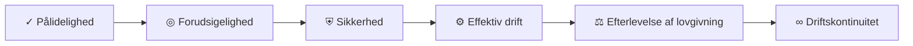
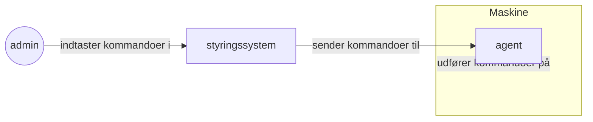
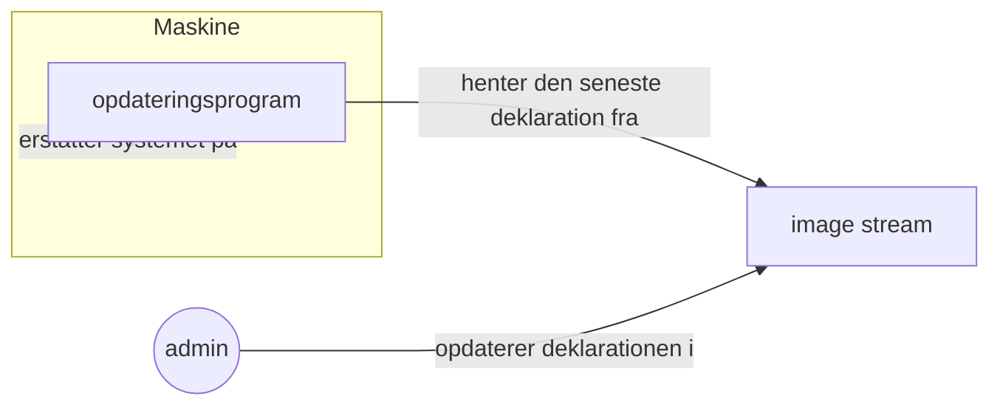
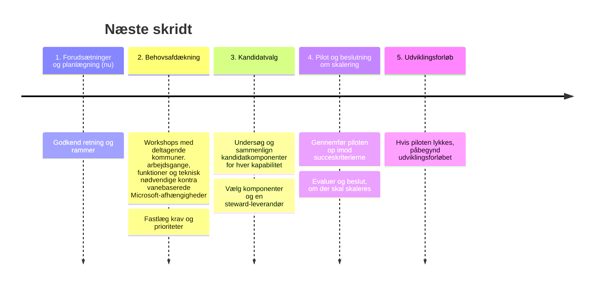

# Behovet for flådestyring

## Behovsafdækning

Administratorer og driftsafdelinger formulerer sjældent nedskrevne tekniske krav — de oplever dem gennem hverdagens friktion. Det omfatter de grundlæggende udfordringer ved at styre mange decentrale enheder med få hænder til at udføre arbejdet. På den baggrund beskriver vi hypoteser om administratorers og driftsafdelingers behov og fastlægger en række højniveaukrav (R1–R6) og metoder (M1–M4).
Disse højniveaukrav og metoder er teknologineutrale: De gælder uanset den anvendte teknologi.

### Højniveaukrav

#### ✓ R1: Pålidelighed

_"Enhederne skal bare virke."_

> Elever, borgere og medarbejdere forventer, at enhederne er tændte, opdaterede og velfungerende hver eneste dag, ideelt set uden at nogen skal røre dem.

**Operationelle krav**

> Flådestyringen skal vedligeholde enhederne automatisk. Enhederne må ikke kræve løbende manuel opmærksomhed.

##### Metoder, der leverer

- **M1 Godkendt tilstand beskrevet ét sted**: ensartede enheder uden afvigelser
- **M2 Automatisk afstemning**: automatiske og kontrollerede opdateringer; ensartet overvågning
- **M3 Sporbar historik og tilbagerulning**: hurtig gendannelse og tilbagerulning af fejl

#### ◎ R2: Forudsigelighed

_"Hvorfor fejler maskinen? Hvem ændrede sidst konfigurationen?"_

> Ændringer laves traditionelt direkte på enkelte enheder eller grupper og bliver sjældent dokumenteret eller gennemgået før idriftsættelse. Derfor kan ingen svare på, hvem der ændrede hvad eller hvornår, når en enhed fejler. I nogle tilfælde udbredes rettelser også fejlagtigt ikke til alle enheder i flåden.

> Flådens tilstand bliver dermed **uforudsigelig.**

**Operationelle krav**

> Flådens tilstand skal til enhver tid kunne forklares og forudsiges: Kun godkendte og dokumenterede ændringer udrulles, og hver ændring kan knyttes til en bestilling eller en beslutning.

##### Metoder, der leverer

- **M3 Sporbar historik og tilbagerulning**: en sporbar historik, som gør det muligt at føre hver ændring tilbage til en beslutning
- **M4 Gennemgang og godkendelse af ændringer**: ændringsstyring efter det klassiske ITIL-rammeværk: En ændring foreslås, gennemgås, godkendes og flettes ind, før den udrulles til flåden, så ændringer aldrig kommer uventet

#### ⛨︎ R3: Sikkerhed

_"Hvis en enhed angribes, skal vi kunne håndtere det — hurtigt og effektivt. Optimalt uden at skulle være fysisk til stede ved maskinen."_

> Sårbarheder skal håndteres tidligt og helst proaktivt. Det skal undgås, at de påvirker hele flåden, men hvis en enhed alligevel kompromitteres, skal den hurtigt og automatisk kunne bringes tilbage til en sikker, godkendt standardtilstand.

**Operationelle krav**

> Enhederne skal opdatere sig selv hurtigt og ensartet, så kendte sårbarheder lukkes proaktivt — og det skal være tæt på umuligt at ændre selve systemet, også hvis en ondsindet aktør får adgang til en enhed.

##### Metoder, der leverer

- **M1 Godkendt tilstand beskrevet ét sted**: en systemkerne, der i praksis ikke kan manipuleres fra enheden
- **M2 Automatisk afstemning**: hurtig og ensartet opdatering af hele flåden; løbende sikkerhedsrapportering
- **M3 Sporbar historik og tilbagerulning**: hurtig gendannelse af ramte enheder til den godkendte standardtilstand

#### ⚙︎ R4: Effektiv drift

_"Vi er få mennesker til mange maskiner."_

> Manuelt arbejde på hver enhed skalerer ikke, når flåden vokser. Driften har brug for, at rutineopgaver håndteres automatisk uden manuel indgriben, så de begrænsede menneskelige ressourcer kan bruges mere effektivt til at levere ny værdi.

**Operationelle krav**

> Rutineopgaver — konfiguration, opdateringer og overvågning — skal udføres automatisk uden manuelt arbejde på hver enhed.

##### Metoder, der leverer

- **M1 Godkendt tilstand beskrevet ét sted**: ændringer forankres i godkendte tilstande for hele flåden
- **M2 Automatisk afstemning**: automatiseret og centralt styret vedligehold

#### ⚖︎ R5: Lovgivningsmæssig efterlevelse

_"Vi skal kunne redegøre for vores systemer."_

> NIS2, GDPR og it-revision kræver, at organisationer kan vise, hvad der er ændret, hvornår og af hvem — og at ændringerne er afprøvet, før de rammer enhederne i drift.

**Operationelle krav**

> Sporbarhed og revisionsdata skal være et naturligt biprodukt af al administration, så efterlevelse bliver billig og enkel.

##### Metoder, der leverer

- **M1 Godkendt tilstand beskrevet ét sted**: konsistent dokumentation
- **M3 Sporbar historik og tilbagerulning**: sporbar historik og revision som et naturligt biprodukt af al administration
- **M4 Gennemgang og godkendelse af ændringer**: godkendelse, før en ændring rammer flåden

#### ∞ R6: Driftskontinuitet

_"Vi er afhængige af kontinuerlig drift — også ved uventede eksterne udviklinger som aftaleophør, opkøb, licensændringer eller nye ejere af platformen."_

> Flådestyringen skal kunne fortsætte, uanset hvad der sker omkring den: Leverandøren kan ophøre, blive opkøbt, ændre licenser eller priser, og hosting kan skifte hænder. Løsningen må derfor ikke afhænge af én leverandør eller ét lukket system — kommunerne skal beholde kontrollen over egne systemer og data.

**Operationelle krav**

> Systemet skal kunne fortsætte og skifte hænder uden afbrydelse: Hele stacken skal kunne genskabes og flyttes til en ny leverandør eller hostingudbyder uden at miste data, konfiguration eller funktionalitet.

##### Metoder, der leverer

- **M1 Godkendt tilstand beskrevet ét sted**: hele stacken (kode, udrulninger og konfiguration) er beskrevet åbent og versionsstyret i Git, så systemet kan genopbygges og flyttes
- **M3 Sporbar historik og tilbagerulning**: leverandøruafhængighed gennem åbne standarder og formater uden proprietære bindinger

## Oversigt over krav og metoder

Fire tilbagevendende metoder dækker tilsammen alle de identificerede scenarier og behov.

Samlet set leveres alle fire metoder af de standardiserede best practices, der er samlet under [OpenGitOps](https://www.cncf.io/projects/opengitops/).

Én metode er særligt krævende: Ændringsstyring (R2 Forudsigelighed) er kun fuldt effektiv, hvis den også gælder selve styresystemet — det vil sige, at OS'et kun kan ændres gennem den godkendte pipeline.

### M1: Godkendt tilstand beskrevet ét sted

Flådens godkendte tilstand lagres som tekst i et versionsstyret depot.

### M2: Automatisk afstemning

Enhederne føres automatisk til den beskrevne tilstand og holdes der.

### M3: Sporbar historik og tilbagerulning

Alle ændringer føres i historikken, kan føres tilbage til en beslutning og kan rulles tilbage.

### M4: Gennemgang og godkendelse af ændringer

Ingen ændring rammer flåden uventet; alt foreslås, gennemgås og godkendes først.

## Generelle strategiske principper

Vi anbefaler, at OS2fri-programmet følger disse principper. Derved kan det sikre en robust, fremtidssikret løsning.

### ∞ R7: Maksimer ressourcerne via genbrug

For at maksimere de ressourcer, der bruges på at levere værdi til offentlige myndigheder, anbefaler vi:

- Følg anerkendte arkitekturstandarder og -principper.
- Genbrug anerkendte standardmetrikker for levedygtighed og sikkerhed, før der træffes beslutning om genbrug af teknologier.
- Undgå at vedligeholde egenudviklede infrastrukturløsninger, hvor der allerede findes en international standard.
- Søg internationale leverandører, særligt på områder hvor dansk ekspertise er sjælden.

### ፠ R8: Digital suverænitet og ejerskab by design

For at være forberedt på eksterne forandringer, der kan påvirke OS2fri-programmets driftskontinuitet, anbefaler vi:

- Alle dele af løsningen — fra dokumentation, kildekode, udrulningsmanifester og skabeloner til den opgavestyring, der definerer leverancen — skal være transparente, styrede og ejet af OS2-myndighederne selv.
- Tag ejerskab over de systemer, der lagrer og håndterer information relateret til OS2fri-programmet.

# Analyse af flådestyring

## Muligheden for (deklarativ) flådestyring

Alle OS2fri-projekter deler udfordringen med at løse dette problem: "Jeg vil etablere en flåde af enheder, som alle har de samme eller lignende softwarekonfigurationer."

Hvordan dette problem løses, er afgørende for de risici, der skal analyseres, og for valget af mulige løsninger.

OS2fri skal tidligt træffe en beslutning: Hvordan får vi maskinerne til at nå den ønskede tilstand?

### Mønster A: Agent som administratorens "forlængede arm"

I dette mønster fungerer en agent på maskinen som administratorens "forlængede arm" og kører kode, der er fastlagt af et centralt system under administratorens kontrol.

### Mønster B: Standardiserede deklarationer

I dette mønster defineres en ønsket maskintilstand for en hel flåde af maskiner. Maskinen konfigureres til at følge den rette maskintilstandskanal og holder sig derefter opdateret via kanalen.

Vi antager, at et design baseret på mønster B, standardiserede deklarationer, er bedre egnet til OS2fris anvendelsestilfælde.

**Hvorfor?** Pålidelighed, sikkerhed, effektiv drift, lovgivningsmæssig efterlevelse, driftskontinuitet

- Kun mønstret "standardiserede deklarationer" garanterer entydigt, at der findes en godkendt systemtilstand, som er beskrevet ét sted (en single source of truth) → leverer på pålidelighed, sikkerhed, effektiv drift, lovgivningsmæssig efterlevelse og driftskontinuitet.

Med standardiserede deklarationer kan vi gennem designet reducere risikoen for følgende hændelser:

- Maskiner begynder at afvige lidt ("drift") fra hinanden på måder, som kun den person, der udførte ændringen, forstår.
- Udokumenterede ændringer på nogle maskiner forårsager kompatibilitetsproblemer ved opdatering.
- Uautoriserede aktører kompromitterer den aktør, der har fuld kontrol, og foretager farlige ændringer i systemet.
- Viden om, hvordan systemer fungerer, går tabt, når kommuner skifter leverandør, eller nøglemedarbejdere skifter job.

Og vi kan bidrage til at sikre:

- At enhver maskine kan bringes tilbage til sin ønskede tilstand.
- At det bliver let at dokumentere, hvilken software der kører på flåden, og hvordan den er konfigureret.

Ved første øjekast synes mønster A velegnet til at understøtte OS2fris behov. På grund af disse fordele har vi imidlertid undersøgt konsekvenserne af at udvide mønster B (standardiserede deklarationer) til et design, der løser nogle af de problemer, der er relevante for OS2fri, og som kræver interaktion med enkeltmaskiner.

## Bemærkning om problemhypoteser

I stedet for at kopiere en eksisterende løsning én til én bør et softwaresystem som OS2fri designes til at løse konkrete problemer.
Under designprocessen for OS2fri deltog en Product Owner fra et relateret projekt i teamet, men ellers havde vi ikke mulighed for at tale med systemets faktiske aktører. Vi forstår for eksempel endnu ikke fuldt ud de administrative medarbejderes faktiske arbejdsgange, prioriteter og vaner.
Derfor _spekulerer_ vi i, hvilke problemer der er vigtige nok til at behandle her.

Under den faktiske udvikling anbefaler vi stærkt, at brugerrepræsentanter inddrages, så de reelle problemer kan undersøges og prioriteres. (Se afsnittet "Næste skridt".)

## Risici ved standardiserede deklarationer

I arbejdet med et OS2Base-design baseret på standardiserede deklarationer fremstod følgende problemtyper som potentielt udfordrende. Vi har analyseret, om hver af dem kan løses inden for dette design; skitser til løsningskandidater er dokumenteret i [solution_candidates.md](solution_candidates.md).

- Afvejningen mellem systembegrænsninger og slutbrugernes behov
- Behovet for at observere flådens tilstand
- Administratorernes behov for en brugervenlig løsning
- Muligheden for at ændre opsætningen på bestemte enheder på afstand frem for i hele flåden

### Problemtype: Begrænsede systemer vs. slutbrugerbehov

Vi antager, at følgende oplevelser vil være ønskelige:

**Admin**: "Jeg kan ikke skrive en systemdeklaration for hver enkelt medarbejder på rådhuset, så jeg skriver én deklaration, der skal fungere for alle."  
**Slutbruger**: "Jeg er nysgerrig på at afprøve et vektorredigeringsprogram i mit arbejde. Forhåbentlig kan jeg bare installere og afprøve et sådant program, uden at det bliver en stor bureaukratisk proces."

### Problem: Hvordan ved vi, hvilken tilstand flåden er i?

Vi antager, at følgende oplevelser vil være ønskelige:

**Slutbruger**: "Av, computeren på biblioteket er lige gået ned! Forhåbentlig bliver nogen hurtigt informeret om det."  
**CISO**: "Nogen har opsat et falsk wi-fi-netværk på vores kontor! Heldigvis kan jeg slå op, hvilke netværk maskinerne på kontoret har været forbundet til."  
**Admin**: "Efter vores seneste opdatering har nogle klaget over problemer med printerforbindelsen. For at finde ud af, hvad der er galt, har jeg virkelig brug for at se, hvilke fejl folk får på deres computere."

### Problem: Problemfri konfigurationsoplevelse

Vi antager, at følgende oplevelser vil være ønskelige:

**Admin**: "Når jeg vil ændre flådens konfiguration, ved jeg, at jeg kan finde den rette indstilling i konfigurationsgrænsefladen. Det er min one-stop-shop for enhver form for konfiguration."  
**Admin**: "De bruger sikkert alverdens kompliceret teknologi til at få systemet til at fungere, men heldigvis behøver jeg ikke at lære noget af det for at ændre konfigurationen."  
**CISO**: "For nylig blev der installeret software på flåden, og jeg vidste ikke rigtig, hvorfor den var der. Heldigvis kunne jeg nemt tjekke, hvem der tilføjede konfigurationen, hvem der godkendte den, og hvornår ændringen blev foretaget."  
**CISO**: "Jeg vil være sikker på, at ingen af mine medarbejdere kan ændre flådens konfiguration uden at få en anden til at gennemgå ændringen."

### Problem: Fjernændringer af systemkonfiguration

Vi antager, at følgende oplevelser vil være ønskelige:

**Admin**: "Maskinerne med numrene 100 til 110 følger 'børnebibliotek'-kanalen, men de skal nu alle følge 'voksenbibliotek'-kanalen. Jeg kan udføre denne ændring uden at skulle tage ud til stedet."  
**Admin**: "Når skoleåret er slut, kan jeg nemt nulstille alle elevmaskiner til standardtilstand, så de er klar til nye elever næste år." ("Powerwash")

# Næste skridt

## Procesrelaterede risici og afbødninger

### Risiko 1: Aftaler om måltilstanden forudsætter direkte én-til-én-funktionalitet

- **Konsekvens:** Fejlprioriterede ressourcer og manglende leverance
- **Afbødning:** Opgavebaseret succeskriterium: "Kan brugerne udføre det samme stykke arbejde?"

### Risiko 2: Midler bruges udelukkende på brugervendt funktionalitet

- **Konsekvens:** Binding til en ny enkeltleverandør uden exit-strategi
- **Afbødning:** Steward-kontrakt, suveræn forge og opgavebaserede succeskriterier fra start

### Risiko 3: Ukendte brugerbehov bestemmer komponentvalget

- **Konsekvens:** Forkerte prioriteringer og dyre omvalg
- **Afbødning:** Behovsafklaring som et obligatorisk første trin, før kandidater vælges

### Risiko 4: Præ-piloter er manuelle og afhængige af bestemte personer

- **Konsekvens:** Ingen driftskontinuitet eller skalerbarhed
- **Afbødning:** Automatiseret udrulning og overvågning via OS2Base

## Tidslinje

Dette dokument giver et udgangspunkt for udviklingen af et OS2fri-program.

For at omsætte vores hypoteser til en succesfuld løsning anbefaler vi følgende rækkefølge af handlinger:

1. Bliv enige om, hvilke næste skridt der skal tages i dette program. Hvilke eksperter skal inddrages i programmets tidlige faser? (For eksempel tekniske eksperter eller produktledelse.)
2. Identificer og kontakt potentielle fremtidige brugere og interessenter i systemet, og undersøg, hvilke problemer OS2fris softwaresystemer skal løse for dem. Adskil de faktiske tekniske behov fra de vaner, brugerne har udviklet på grund af deres afhængighed af Microsofts løsninger. Prioritér de brugerproblemer, der er vigtigst at løse, og som medfører den højeste risiko for tekniske udfordringer. OS2Skoles igangværende (pr. midten af 2026) arbejde med problemopdagelse er et godt eksempel på dette.
3. Udarbejd løsningskandidater for hver uafhængig problemtype (kapabilitet). Undersøg eksisterende løsninger og de metoder og mønstre, de anvender for at nå deres mål. I denne fase anbefaler vi at samarbejde med specialiserede leverandører.
4. Lav en eksperimentel prototype, og indhent feedback fra interessenterne i trin 2. Opfylder prototypen de på forhånd definerede succeskriterier? Har udviklingen af prototypen synliggjort implementeringsudfordringer, som tidligere var uklare? Analysér: Er det, set i lyset af den feedback, der er kommet i fasen, værd at fortsætte programmet?
5. Hvis ja, vejled leverandører i udviklingen af en produktionsklar løsning. Udarbejd en "arbejdsform", der guider udviklingsprocessen i denne fase. Vi anbefaler en tilgang med regelmæssig afprøvning, som gør det muligt at justere på baggrund af feedback fra interessenter.

## Foreslået pilot og succeskriterier

**Pilot:** En OS2Base-styret pc-flåde med browseradgang til simpelt konfigureret groupware, der kun sameksisterer med proprietære platforme via åbne standarder — _et åbent Linux-baseret OS, en åben groupware og adgang via åbne standarder_.

- Driftsstrategier med digital suverænitet, der sikrer transparens og giver OS2 ejerskab over alle komponenter
- Driftskontinuitet gennem ensartethed og automatisering
- Åben, suveræn infrastruktur til automatiseret udrulning og overvågning, der gør det muligt at fjerne afhængigheder af enkeltpersoner og leverandører (OS2Base plus bæredygtig finansiering af vedligehold og drift)
- Udskiftning af leverandørbundne groupware-komponenter (fildeling, mail, kalender, kontakter og webbaseret kontorpakke) med versioner, hvor myndighederne gennem OS2 ejer hele leverancekæden: applikationskode, kode til softwareleverancekæden, dokumentationskode og infrastrukturkode (IaC)

**Målbare succeskriterier** (antal deltagere og varighed aftales ved godkendelse):

1. Et aftalt antal administrative brugere løser deres kerneopgaver — mail, kalender, dokumenter og fildeling — udelukkende på OS2admPC gennem hele pilotperioden.
2. Samarbejde med brugere på Microsoft-platformen fungerer via åbne standarder uden manuelle omveje.
3. It-drift udruller og opdaterer alle piloteenheder centralt og automatisk via OS2Base uden enhedsspecifikke manuelle trin.
4. Andelen af brugere, der kan udføre "det samme stykke arbejde" som før, måles før og efter piloten.
5. Projektets samlede kode, dokumentation og infrastruktur er tilgængelig på en OS2-ejet forge ved pilotens afslutning.
