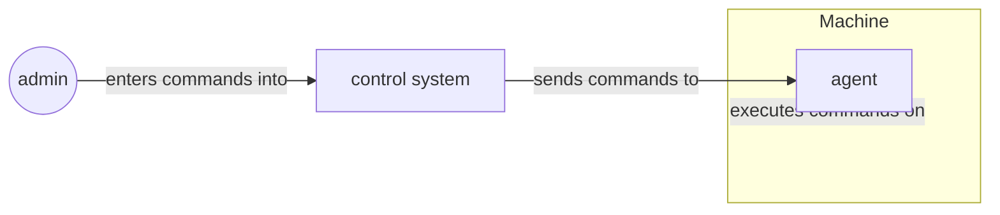
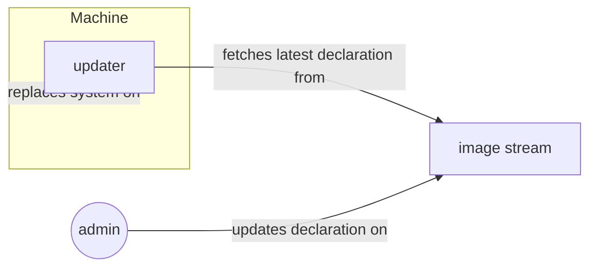
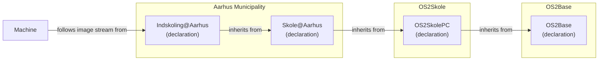
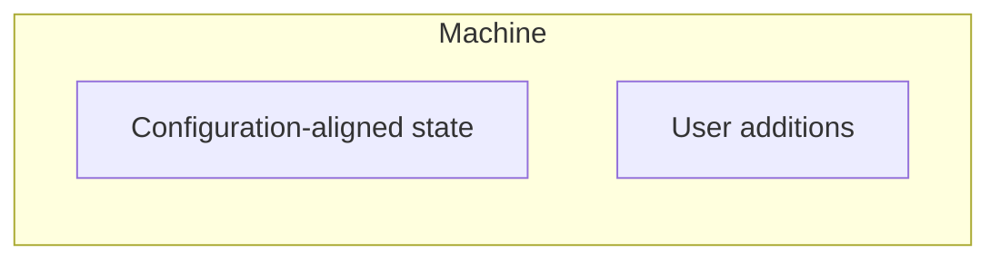
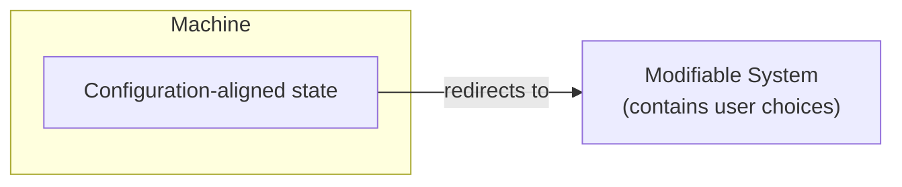
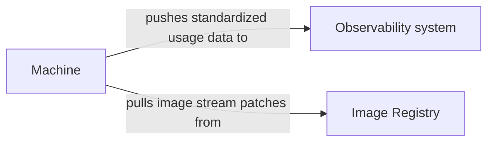
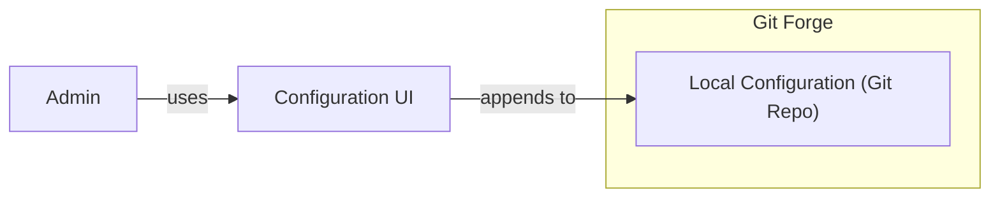
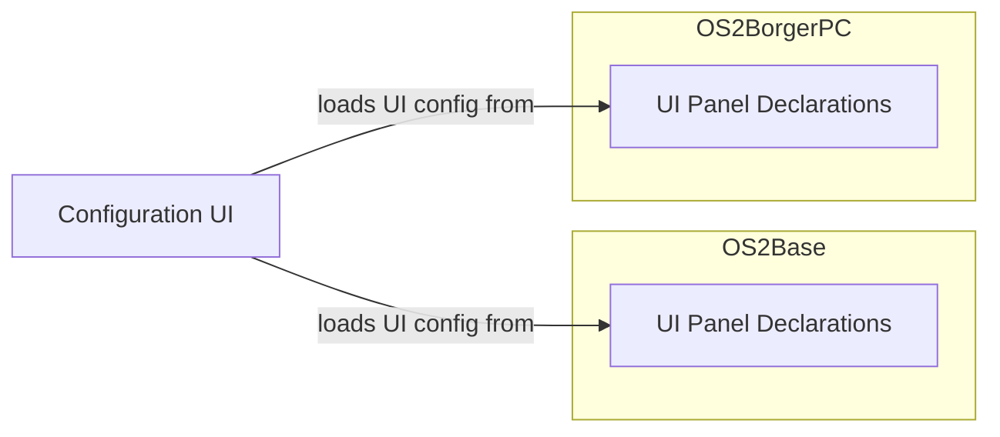
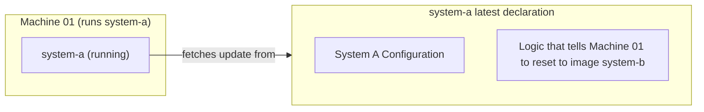

# Key Design Considerations

All os2fri projects share the challenge of solving this problem: "I want to set up a fleet of devices that all share the same or similar software configurations."

How this problem is solved is crucial for the risks that need to be analyzed, as well as the decision making on potential solutions.

OS2fri must decide early: How do we get the machines to achieve the desired state?

### Pattern A: Agent as the admin's "extended hand"

In this pattern, a machine agent serves as the administrator's "extended hand" and runs code decided on by a central, administrator-controlled system.

---

### Pattern B: Standardized declarations

In this pattern, a desired machine state for a whole fleet of machines is defined. The machine is pointed at the right machine state channel, and then keeps itself up to date with the machine state channel.

We hypothesize that Pattern B is more suitable for os2fri's use case.

**Why?** Pålidelighed, Sikkerhed, Effektiv drift, Lovgivningsmæssig efterlevelse, Driftskontinuitet

At first glance, Pattern A seems well suited to support the needs of os2fri. Nonetheless, we investigated the consequences of extending Pattern B so that it solves all the problems relevant to os2fri that require interactions with individual machines.

**Why?**

- Ensures that there is an approved system state which is described in a single location (single source of truth) -> Leverer på Pålidelighed, Sikkerhed, Effektiv drift, Lovgivningsmæssig efterlevelse, Driftskontinuitet.
We want to avoid:
- Machines start to slightly deviate ("drift") from each other, and only the person who made the change understands how.
- Undocumented changes to some machines cause update compatibility problems
- Unauthorized actors breach into the all-powerful actor, and perform dangerous changes to the system
- Knowledge about how systems work gets lost when municipalities change suppliers, or key employees change job
We want:
- Every machine can be returned to its desired state
- It makes it easy to document which software runs on the fleet and how it is configured.

We will now describe how we solve individual problems within the confines of Pattern B.

---

# Note on problem speculations

A software system should be designed to solve specific problems.
During the design process for os2fri, one Product Owner of a related project was part of the team, but otherwise we were not able to talk to the actual participants of the system.
Therefore, we are _speculating_ about which problems are important enough to discuss here.

During actual development, user representatives must be included so that the actual problems can be investigated and prioritized.

While envisioning OS2base, the following problem types appeared potentially challenging, so we decided to analyze early whether they can be solved within the Standardized Declarations pattern:

- The trade-off between system restrictions and end-user needs
- The need to observe the state of the fleet
- The ease of use that we need administrators to experience with the system
- Remotely changing the set up of specific devices, rather than on the entire fleet

---

# Problem type: Restricted systems vs. End-user needs

👸 End User
🧑‍💻 Admin

🧑‍💻 "I can't write a system declaration for every single employee at the city hall, so I'm going to write one declaration that should work for everyone."
👸 "I'm curious about trying out a vector editing program in my workflow. Hopefully I can just install and trial a program like that without it turning into a big bureaucracy."

---

## Solution Design

Example: Indskolings-PC at Aarhus Municipality:

---

To avoid ending up with one declaration per machine:

### Addition pattern

The administrator may allow the end-user to _extend_ their existing software system. But the end-user is never allowed to _remove_ or _modify_ parts of the configuration-aligned state.

For example: User "I want to be able to install software that is relevant to my use case."
Solution: Provide a list of apps that are allowed to be installed on the system. These apps must not change any of the parameters that the admin relies on (existing sandboxing solutions for this exist).

### Reference pattern

Another example: User "I want to be able to use the right printer at my office."
Solution: Make the system agnostic to which specific printer is being used by a user. Every machine has a pathway to a long list of printers, with permission rights enforced at the printer or network level.

---

# Problem: How do we know the state of the fleet?

👸 End User
🧑‍💻 Admin
👩‍💼 CISO

👸 "Ouch, the computer at the library just crashed! Hopefully someone is notified of this quickly."
👩‍💼 "Someone set up a fake wifi at our office! Luckily, I can look up which networks the machines in the office have connected to."
🧑‍💻 "After our latest update, some people have been complaining about printer connectivity issues. But to figure out what's wrong, I really need to see what errors people are getting on their computers."

---

## Solution Design

- Each machine exposes standardized observability data
- There is an observability central system that collects all this data
- Observability data is converted into a standardized format

So the information flow becomes:

Required machine components:

- Machine Data Collector (a component that collects machine behavior, converts this behavior into the standardized usage data format, and sends it to the observability system)
- Update Checker (a component that regularly checks whether there are new image patches, downloads them, and applies them to the machine)

---

# Problem: Seamless configuration experience

🧑‍💻 Admin
👩‍💼 CISO

Predicted problems:

🧑‍💻 "When I want to change the configuration of the fleet, I know I can find the right setting in the configuration interface. It's my one-stop-shop for any sort of configuration."
🧑‍💻 "I'm sure they're using all sorts of complicated technology to make this system work, but luckily, I don't have to learn about any of it to change the configuration."
👩‍💼 "Recently, some software was installed on the fleet, and I didn't really know why it was there. Luckily, I could easily check who added this configuration, who approved it, and when the change was made."
👩‍💼 "I want to be sure that none of my employees can change the fleet config without having someone else review the change."

---

## Solution Design

- Configuration management is based on an existing VCS solution like Git. **Why?** This solution gives us sporbar historik, tilbagerulning, gennemgang og godkendelse af ændringer for free
- As part of os2fri, a thin layer on top of Git is created, which makes configuration easier for local admins
- OS2Base provides the UI logic for the configuration interface, and investigates the appropriate visual/experience design language
- The UI logic converts a standardized intermediary format into a UI
- The individual os2fri products expose configuration items in the standardized intermediary format

Making the Configuration UI seamless across project boundaries:

---

# Problem: Remote system configuration change

🧑‍💻 Admin

Predicted problems:

🧑‍💻 "Machines 100 to 110 are following the 'børnebibliotek' channel, but they're meant to all be 'voksenbibliotek' now. I can perform this change without having to go to the location."
🧑‍💻 "When school year is over, I can easily reset all student machines to default state so they're ready for new students in the next year." ("Powerwash")

---

## Solution Design

**Important:** If the "remote" requirement is not as strict, other designs are better than this!

Specific manipulation pathways need to be investigated ahead of time, and then logic for those manipulations is added to the system.

Because a specific system only ever pulls the same configuration that other systems are also pulling, the problems can be solved as follows:

- Specific manipulation paths are pre-configured into the image.
- With every image update, a list gets downloaded by all machines, and this list contains the IDs of all machines onto which the manipulation is to be applied.
- This means that every machine has some unique, immutable identification.

**Important:** Per-machine changes only move the machine to the state of a known, approved image stream.
