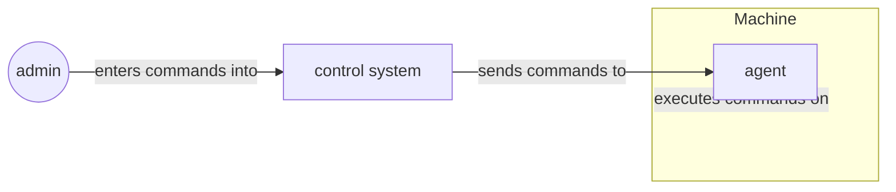
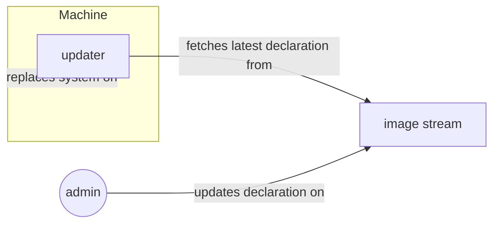
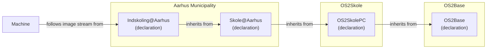
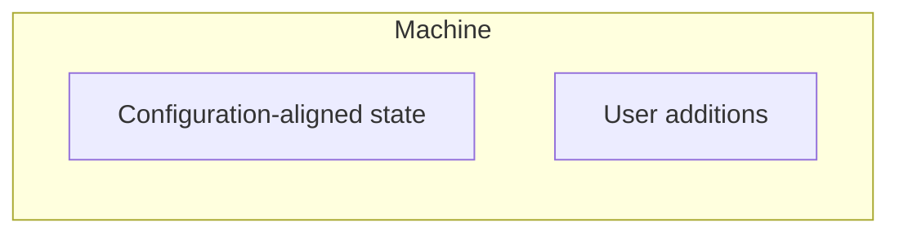
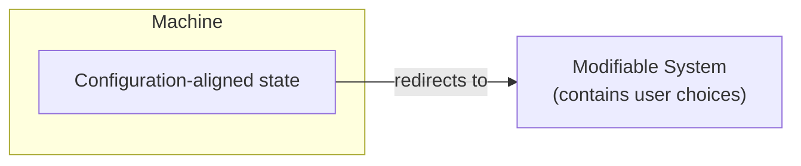
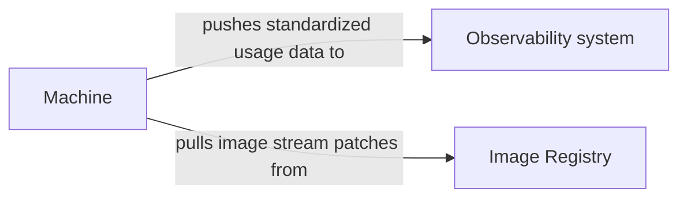
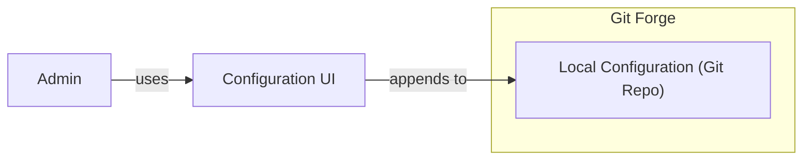
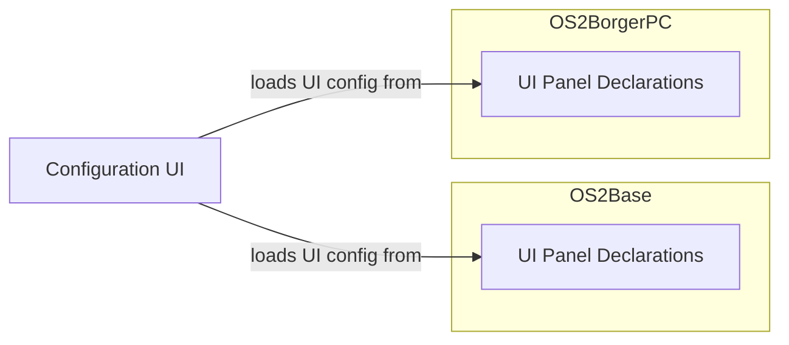
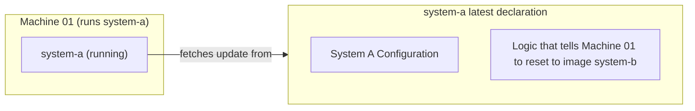

# Behov for flådestyring
_Da der ikke er indsamlet og dokumenteret behov for OS2fri endnu, forsøger dette dokumente at opridse nogle behov og metoder, på baggrund af akkumulerede erfaringer med device management i offentlige myndigheder gennem det sidste årti._

## Behovsafdækning

Administratorer og driftsafdelinger formulerer sjældent nedskrevne tekniske krav — de oplever dem gennem hverdagens friktion. Herunder de basale udfordinger når der er mange decentrale enheder at styre og få hænder til at udføre arbejdet. Ud fra dette beskriver dokumentet **administratorenes og driftsafdelingernes behov** og fastlægger en række højniveau-krav (R1–R6) samt en række metoder (M1–M4).
Højniveaukravene og metoderne er formuleret teknologineutralt, så dokumentet er gyldigt uanset teknologi.
Hvilke teknologier der kan anvendes til at implementere metoderne, vurderes seperat pr. teknologi i et seperat dokument: [bootc-reference.md](bootc-reference.md).

### Højniveau-krav

---

#### ✓ R1: Pålidelighed
_"Enhederne skal bare virke."_

> Elever, borgere og medarbejdere forventer, at enhederne er tændte, opdaterede og velfungerende hver eneste dag, ideelt set uden at nogen skal røre dem.

**Operationelle krav**

> Flådestyringen skal vedligeholde enhederne af sig selv. Enhederne skal ikke kræve løbende manuel opmærksomhed.

##### Metoder der leverer

| ✓ | ✓ |  ✓ |
| :--- | :--- | :--   |
|   **M1 Godkendt tilstand beskrevet ét sted** — ensartede enheder uden afvigelser |   **M2 Automatisk afstemning** — automatiske og kontrollerede opdateringer; ensartet overvågning |  **M3 Sporbar historik og tilbagerulning** — hurtig gendannelse og tilbagerulning af fejl |

#### ◎ R2: Forudsigelighed
_"Hvorfor fejler maskinen? Hvem har pillet ved konfigurationen sidst?"_

> Ændringer laves traditionelt direkte på enkelte enheder eller grupper og bliver sjældent dokumenteret eller gennemgået før idriftsættelse. Så når en enhed fejler, kan ingen svare på, hvem der ændrede hvad eller hvornår. I nogle tilfælde udbredes rettelser fejlagtigt ikke til alle enheder i hele flåden.

> Flådens tilstand bliver dermed **uforudsigelig.**

**Operationelle krav**

> Flådens tilstand skal til enhver tid kunne forklares og forudsiges: kun godkendte og dokumenterede ændringer udrulles, og hver ændring kan knyttes til en bestilling eller en beslutning.

##### Metoder der leverer

| ✓ | ✓ |
| :--- | :--- |
| **M3 Sporbar historik og tilbagerulning** — sporbar historik, så hver ændring kan føres tilbage til en beslutn | **M4 Gennemgang og godkendelse af ændringer** — ændringsstyring efter det klassiske ITIL-rammeværk: en ændring foreslås, gennemgås, godkendes og flettes ind, før den udrulles til flåden, så ændringer aldrig kommer uventet |

---

#### ⛨︎ R3: Sikkerhed
_"Hvis en enhed angribes, skal vi kunne håndtere det — hurtigt og effektivt. Optimalt uden at skulle være fysisk til stede ved maskinen."_

> Sårbarheder skal håndteres tidligt og gerne proaktivt. Det skal undgås, at de påvirker hele flåden, men hvis en enhed alligevel rammes, skal enheden hurtigt og automatisk kunne bringes tilbage i en sikker, godkendt standardtilstand.

**Operationelle krav**

> Enhederne skal opdatere sig selv hurtigt og ensartet, så kendte sårbarheder lukkes proaktivt — og det skal være tæt på umuligt at ændre på selve systemet, også hvis en ondsindet aktør får adgang til en enhed.

##### Metoder der leverer

| ✓ | ✓ | ✓ |
| :--- | :--- | :--- |
| **M1 Godkendt tilstand beskrevet ét sted** — systemkerne, der i praksis ikke kan manipuleres fra enheden | **M2 Automatisk afstemning** — hurtig og ensartet opdatering af hele flåden; løbende sikkerhedsrapportering | **M3 Sporbar historik og tilbagerulning** — hurtig gendannelse af ramte enheder til den godkendte standardtilstand |

---

#### ⚙︎ R4: Effektiv drift
_"Vi er få mennesker til mange maskiner."_

> Manuelt arbejde per enhed skalerer ikke, hvis flåden vokser. Driften har brug for, at rutineopgaverne klares automatisk uden manuel indgriben, så de sparsomme menneskelige ressourcer bruges på at levere ny værdi mere effektivt.

**Operationelle krav**

> Rutineopgaver (konfiguration, opdatering, overvågning) skal klares automatisk uden krav om manuelt per-enhed-arbejde.

##### Metoder der leverer

| ✓ | ✓ |
| :--- | :--- |
| **M1 Godkendt tilstand beskrevet ét sted** — ændringer forankres i godkendte tilstande for hele flåden | **M2 Automatisk afstemning** — automatiseret og centralt styret vedligehold |

---

#### ⚖︎ R5: Lovgivningsmæssig efterlevelse
_"Vi skal kunne redegøre for vores systemer."_

> NIS2, GDPR og it-revision kræver, at man kan vise, hvad der er ændret, hvornår og af hvem — og at ændringerne er afprøvet, før de rammer enhederne i drift.

**Operationelle krav**

> Sporbarhed og revisionsdata skal være et naturligt biprodukt af al administration, så efterlevelse bliver billig og enkel.

##### Metoder der leverer

| ✓ | ✓ | ✓ |
| :--- | :--- | :--- |
| **M1 Godkendt tilstand beskrevet ét sted** — konsistent dokumentation | **M3 Sporbar historik og tilbagerulning** — sporbar historik og revision som et naturligt biprodukt af al administration | **M4 Gennemgang og godkendelse af ændringer** — godkendelse, før en ændring rammer flåden |

---

#### ∞ R6: Driftskontinuitet
_"Vi er afhængige af kontinuerlig drift — også ved uventede eksterne hændelser: aftaleophør, opkøb, licensændringer eller nye ejere af platformen."_

> Flådestyringen skal kunne fortsætte, uanset hvad der sker omkring den: leverandøren kan ophøre, blive opkøbt, ændre licenser eller priser, og hosting kan skifte hænder. Løsningen må derfor ikke afhænge af én leverandør eller ét lukket system — kommunerne skal beholde kontrollen over egne systemer og data.

**Operationelle krav**

> Systemet skal kunne fortsætte og skifte hænder uden afbrydelse: hele stacken skal kunne genskabes og flyttes til en ny leverandør eller hosting uden at miste data, konfiguration eller funktionalitet.

##### Metoder der leverer

| ✓ | ✓ |
| :--- | :--- |
| **M1 Godkendt tilstand beskrevet ét sted** — hele stacken (kode, deployments, konfiguration) beskrevet åbent og versionsstyret i git, så systemet kan genopbygges og flyttes | **M3 Sporbar historik og tilbagerulning** — leverandøruafhængighed: åbne standarder og formater uden proprietære bindinger |

## Oversigt over krav og metoder

På tværs af kravene går fire metoder igen, der tilsammen dækker alle de opstillede scenarier og behov:

| Krav | M1 Godkendt tilstand | M2 Automatisk afstemning | M3 Sporbar historik og tilbagerulning | M4 Gennemgang og godkendelse |
| :--- | :-: | :-: | :-: | :-: |
| **R1** Pålidelighed | ✓ | ✓ | ✓ | – |
| **R2** Forudsigelighed | – | – | ✓ | ✓ |
| **R3** Sikkerhed | ✓ | ✓ | ✓ | – |
| **R4** Effektiv drift | ✓ | ✓ | – | – |
| **R5** Lovgivningsmæssig efterlevelse | ✓ | – | ✓ | ✓ |
| **R6** Driftskontinuitet | ✓ | – | ✓ | – |

_✓ = metoden kan levere på kravet · – = ingen direkte kobling_

### M1: Godkendt tilstand beskrevet ét sted

Fladens godkendte tilstand ligger som tekst i et versionsstyret depot.

- **Leverer på:** R1 Pålidelighed · R3 Sikkerhed · R4 Effektiv drift · R5 Lovgivningsmæssig efterlevelse · R6 Driftskontinuitet.

### M2: Automatisk afstemning

Enhederne føres automatisk til den beskrevne tilstand og holdes der.

- **Leverer på:** R1 Pålidelighed · R3 Sikkerhed · R4 Effektiv drift.

### M3: Sporbar historik og tilbagerulning

Alle ændringer føres i historik, kan føres tilbage til en beslutning og rulles tilbage.

- **Leverer på:** R1 Pålidelighed · R2 Forudsigelighed · R3 Sikkerhed · R5 Lovgivningsmæssig efterlevelse · R6 Driftskontinuitet.

### M4: Gennemgang og godkendelse af ændringer

Ingen ændring rammer flåden uventet; alt foreslås, gennemgås og godkendes først.

- **Leverer på:** R2 Forudsigelighed · R5 Lovgivningsmæssig efterlevelse.

Set samlet leveres alle fire metoder af de standardiserede best practices, der er samlet under [OpenGitOps](https://www.cncf.io/projects/opengitops/).

Én metode er særlig krævende: ændringsstyringen (R2 Forudsigelighed) lever kun fuldt ud, hvis den også gælder selve styresystemet — at OS'et kun kan ændres gennem den godkendte pipeline. Om en teknologi kan levere det, vurderes i [bootc-reference.md](bootc-reference.md).

---

## Generelle strategiske principper
_Projektet bør operere inden for nationale og internationale arkitektur og leveranceprincipper for at sikre en fremtidssikret og robust løsning_

### ∞ R7: Maksimer ressourcerne via genbrug
_"Vi skal maksimere ressourcerne der anvendes til at levere værdi til myndighederne, ikke på at vedligeholde egenopfundne infrastruktur løsninger når der findes en international standard"_
> Følg anerkendte arkitektur standarder og principper. Genbrug anderkendte standard metrikker for levedygtighed og sikkerhed før valg om genbrug af teknologier træffes.

### ፠ R8: Digital Suverænitet og ejerskab by design
_"Vi skal som myndigheder selv eje 100% af løsningen, så vi er rustede til eksterne forandringer der kan påvirke vores driftskontinuitet"_
> Alle dele af løsningen lige fra dokumentation, kildekode, udrulningsmanifester, skabeloner og den opgavestyring der tegner leverancen skal været transparent, styret og ejet af os2 myndighederne selv.

### ༄ R9: Byg til fremtiden efter anerkendte principper
_"For at spare tid og penge, skal vi genanvende de rette nationale og internationale arktieturprincipper istedet for at lade en leverandør eller en stærk enkeltaktør styre udviklingen og skævvride værdileverancen til fællesskabet"_
> For at levere en fair og solidarisk bred værdi til myndighederne i os2 fælleskabet skal vi lade os guide af den kollektive massive erfaring i at udvikle og levere software der ligger frit tilgængeligt i den internationale litteratur om arkitektur mønstre og modeller. OS2 er sat i verden for at levere værdi til det offentlige Danmark ikke opfinde ny infrastruktur fra bunden.

# Risk Analysis

## Væsentlige risici og afbødninger

| Risiko | Konsekvens | Afbødning |
|---|---|---|
| Målbillede-aftaler indeholder antagelser om direkte 1:1-funktionalitet med "As-is" | Fejlprioriterede ressourcer, manglende leverance | Opgavebaseret succeskriterium: "kan man lave det samme stykke arbejde?" |
| Midlerne bruges kun på brugervendt funktionalitet uden suveræn infrastruktur | Binding til en ny enkeltleverandør uden exit-strategi | Steward-kontrakt, suveræn forge og opgavebaseret succeskriterium fra start |
| Troen på at suverænitet kun handler om leverandørens nationalitet | Kontrol med hverken kode, byggekæde eller drift ("black box"-drift) | Ejerskab til __hele__ leverancekæden: kildekode, dokumentation og infrastruktur under OS2 |
| Alt placeres på GitHub (BigTech-ejet platform) | "Red button"-risiko: adgangen til projektets samlede leverance kan begrænses uden varsel | OS2-ejet, digital suveræn forge |
| Ukendte brugerbehov styrer komponentvalg | Forkerte prioriteringer og dyre omvalg | Behovsafklaring som obligatorisk trin 1, før kandidater vælges |
| Præ-piloter er manuelle og personbundne | Ingen driftskontinuitet eller skalerbarhed | Automatiseret udrulning og overvågning via OS2Base |

## Feasibility of (Declarative) Fleet Management

All os2fri projects share the challenge of solving this problem: "I want to set up a fleet of devices that all share the same or similar software configurations."

How this problem is solved is crucial for the risks that need to be analyzed, as well as the decision making on potential solutions.

OS2fri must decide early: How do we get the machines to achieve the desired state?

### Pattern A: Agent as the admin's "extended hand"

In this pattern, a machine agent serves as the administrator's "extended hand" and runs code decided on by a central, administrator-controlled system.

---

### Pattern B: Standardized declarations

In this pattern, a desired machine state for a whole fleet of machines is defined. The machine is pointed at the right machine state channel, and then keeps itself up to date with the machine state channel.

We hypothesize that Pattern B is more suitable for os2fri's use case.

**Why?** Pålidelighed, Sikkerhed, Effektiv drift, Lovgivningsmæssig efterlevelse, Driftskontinuitet

At first glance, Pattern A seems well suited to support the needs of os2fri. Nonetheless, we investigated the consequences of extending Pattern B so that it solves all the problems relevant to os2fri that require interactions with individual machines.

**Why?**

- Ensures that there is an approved system state which is described in a single location (single source of truth) -> Leverer på Pålidelighed, Sikkerhed, Effektiv drift, Lovgivningsmæssig efterlevelse, Driftskontinuitet.
We want to avoid:
- Machines start to slightly deviate ("drift") from each other, and only the person who made the change understands how.
- Undocumented changes to some machines cause update compatibility problems
- Unauthorized actors breach into the all-powerful actor, and perform dangerous changes to the system
- Knowledge about how systems work gets lost when municipalities change suppliers, or key employees change job
We want:
- Every machine can be returned to its desired state
- It makes it easy to document which software runs on the fleet and how it is configured.

We will now describe how we solve individual problems within the confines of Pattern B.

---

## Note on problem speculations

A software system should be designed to solve specific problems.
During the design process for os2fri, one Product Owner of a related project was part of the team, but otherwise we were not able to talk to the actual participants of the system.
Therefore, we are _speculating_ about which problems are important enough to discuss here.

During actual development, user representatives must be included so that the actual problems can be investigated and prioritized.

Projektets målbilleder hviler i dag på nogle eksplicitte antagelser, ikke på målte brugerbehov eller data:

- Vi kender endnu ikke 100% de administrative medarbejderes faktiske arbejdsgange, prioriteringer og vaner. Funktionslisten for en "let administrativ bruger" kan derfor først fastlægges efter en behovsafklaring med deltager-myndighederne.
- De eksisterende afhængigheder til Microsoft, Google, fagsystemer etc. skal deles op i, hvad der er **teknisk nødvendigt**, og hvad der er afledt af nuværende **arbejdsgange, skabeloner eller vaner** — først denne opdeling viser, hvad der reelt bør genskabes.
- Komponentvalg i løsningen skal prioritere beviselig sikkerhed, compliance, interoperabilitet, skalerbarhed og digital suverænitet/dataejerskab. Disse rammer er med til at perspektivere målbilledet og sætte et stærkt rækværk op imod risikable beslutninger baseret på antagelser om "To-Be" løsningen.

## Standardized declarations risks

While envisioning OS2base, the following problem types appeared potentially challenging, so we decided to analyze early whether they can be solved within the Standardized Declarations pattern:

- The trade-off between system restrictions and end-user needs
- The need to observe the state of the fleet
- The ease of use that we need administrators to experience with the system
- Remotely changing the set up of specific devices, rather than on the entire fleet

---

### Problem type: Restricted systems vs. End-user needs

👸 End User
🧑‍💻 Admin

🧑‍💻 "I can't write a system declaration for every single employee at the city hall, so I'm going to write one declaration that should work for everyone."
👸 "I'm curious about trying out a vector editing program in my workflow. Hopefully I can just install and trial a program like that without it turning into a big bureaucracy."

---

#### Solution Design

Example: Indskolings-PC at Aarhus Municipality:

---

To avoid ending up with one declaration per machine:

##### Addition pattern

The administrator may allow the end-user to _extend_ their existing software system. But the end-user is never allowed to _remove_ or _modify_ parts of the configuration-aligned state.

For example: User "I want to be able to install software that is relevant to my use case."
Solution: Provide a list of apps that are allowed to be installed on the system. These apps must not change any of the parameters that the admin relies on (existing sandboxing solutions for this exist).

##### Reference pattern

Another example: User "I want to be able to use the right printer at my office."
Solution: Make the system agnostic to which specific printer is being used by a user. Every machine has a pathway to a long list of printers, with permission rights enforced at the printer or network level.

---

### Problem: How do we know the state of the fleet?

👸 End User
🧑‍💻 Admin
👩‍💼 CISO

👸 "Ouch, the computer at the library just crashed! Hopefully someone is notified of this quickly."
👩‍💼 "Someone set up a fake wifi at our office! Luckily, I can look up which networks the machines in the office have connected to."
🧑‍💻 "After our latest update, some people have been complaining about printer connectivity issues. But to figure out what's wrong, I really need to see what errors people are getting on their computers."

---

#### Solution Design

- Each machine exposes standardized observability data
- There is an observability central system that collects all this data
- Observability data is converted into a standardized format

So the information flow becomes:

Required machine components:

- Machine Data Collector (a component that collects machine behavior, converts this behavior into the standardized usage data format, and sends it to the observability system)
- Update Checker (a component that regularly checks whether there are new image patches, downloads them, and applies them to the machine)

---

### Problem: Seamless configuration experience

🧑‍💻 Admin
👩‍💼 CISO

Predicted problems:

🧑‍💻 "When I want to change the configuration of the fleet, I know I can find the right setting in the configuration interface. It's my one-stop-shop for any sort of configuration."
🧑‍💻 "I'm sure they're using all sorts of complicated technology to make this system work, but luckily, I don't have to learn about any of it to change the configuration."
👩‍💼 "Recently, some software was installed on the fleet, and I didn't really know why it was there. Luckily, I could easily check who added this configuration, who approved it, and when the change was made."
👩‍💼 "I want to be sure that none of my employees can change the fleet config without having someone else review the change."

---

#### Solution Design

- Configuration management is based on an existing VCS solution like Git. **Why?** This solution gives us sporbar historik, tilbagerulning, gennemgang og godkendelse af ændringer for free
- As part of os2fri, a thin layer on top of Git is created, which makes configuration easier for local admins
- OS2Base provides the UI logic for the configuration interface, and investigates the appropriate visual/experience design language
- The UI logic converts a standardized intermediary format into a UI
- The individual os2fri products expose configuration items in the standardized intermediary format

Making the Configuration UI seamless across project boundaries:

---

### Problem: Remote system configuration change

🧑‍💻 Admin

Predicted problems:

🧑‍💻 "Machines 100 to 110 are following the 'børnebibliotek' channel, but they're meant to all be 'voksenbibliotek' now. I can perform this change without having to go to the location."
🧑‍💻 "When school year is over, I can easily reset all student machines to default state so they're ready for new students in the next year." ("Powerwash")

---

#### Solution Design

**Important:** If the "remote" requirement is not as strict, other designs are better than this!

Specific manipulation pathways need to be investigated ahead of time, and then logic for those manipulations is added to the system.

Because a specific system only ever pulls the same configuration that other systems are also pulling, the problems can be solved as follows:

- Specific manipulation paths are pre-configured into the image.
- With every image update, a list gets downloaded by all machines, and this list contains the IDs of all machines onto which the manipulation is to be applied.
- This means that every machine has some unique, immutable identification.

**Important:** Per-machine changes only move the machine to the state of a known, approved image stream.

# Next Steps

## Forslag til pilot og succeskriterier

**Pilot:** OS2Base-styret PC-flåde med browseradgang til simpelt konfigureret groupware, der kun sameksisterer med proprietære platforme via åbne standarder — _et åbent Linux-baseret OS, en åben groupware, adgang via åbne standarder_.

- Digitale suveræne operationelle strategier, der sikrer transparens og giver OS2 ejerskab til alle bestanddele
- Driftskontinuitet via ensartethed og automatisering
- En åben, suveræn infrastruktur til automatiseret udrulning og overvågning, så person- og leverandørbindinger kan løsnes (OS2Base + bæredygtig finansiering af vedligehold og drift)
- Udskiftning af leverandørbundne groupware-komponenter (fildeling, mail, kalender, kontakter, web-kontorpakke) med udgaver, hvor myndighederne via OS2 ejer hele leverancekæden: applikations-, leverancekæde-, dokumentations- og infrastrukturkode (IaC)

**Målbare succeskriterier** (antal og varighed aftales ved godkendelse):

1. Et aftalt antal administrative brugere løser deres kerneopgaver (mail, kalender, dokumenter, fildeling) udelukkende på OS2admPC gennem hele pilotperioden
2. Samarbejde med brugere på Microsoft-platformen fungerer via åbne standarder uden manuelle omveje
3. IT-drift udruller og opdaterer alle piloteenheder centralt og automatiseret via OS2Base — ingen enhedsspecifikke manuelle trin
4. Andelen af brugere, der kan udføre "det samme stykke arbejde" som før, måles før/efter piloten
5. Projektets samlede kode, dokumentation og infrastruktur er tilgængelig på en OS2-ejet forge ved pilotens afslutning

## Næste skridt

| Trin | Indhold | Beslutning |
|---|---|---|
| **Trin 0 — nu** | Forudsætninger og planlægning | Godkend retning og rammer |
| **Trin 1 — behovsafklaring** | Workshops med deltagerkommuner: arbejdsgange, funktioner, tekniske vs. vanebaserede Microsoft-afhængigheder | Krav og prioriteter fastlægges |
| **Trin 2 — kandidatvalg** | Afdækning og sammenligning af kandidatkomponenter pr. kapabilitet | Vælg komponenter og steward-leverandør |
| **Trin 3 — pilot & skalering** | Gennemfør pilot mod succeskriterierne | Evaluer og beslut skalering |

