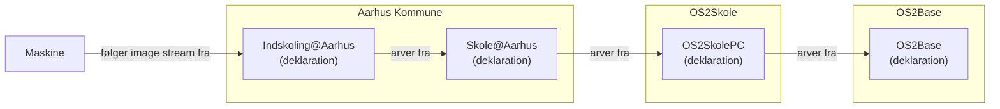
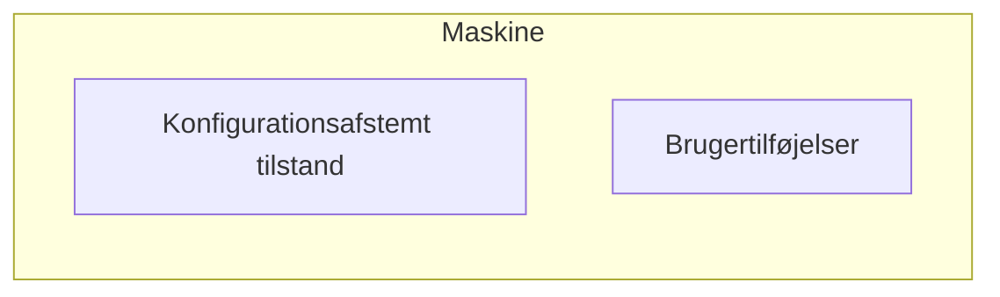
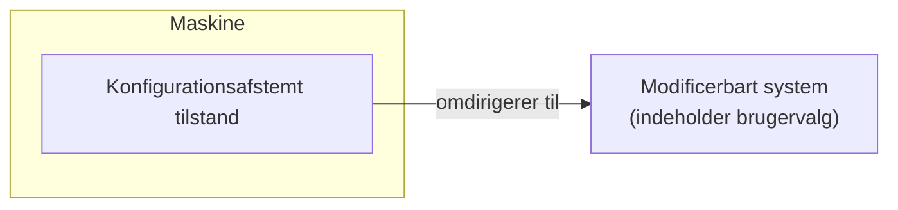
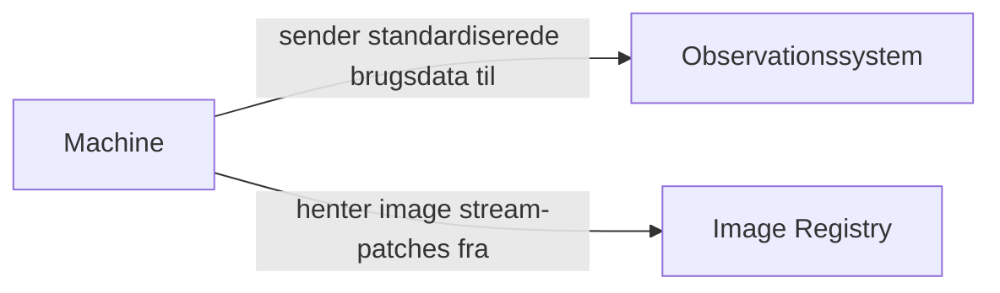
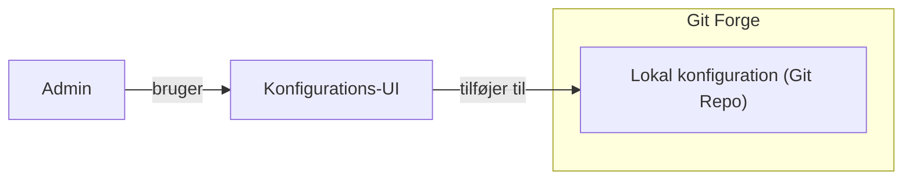
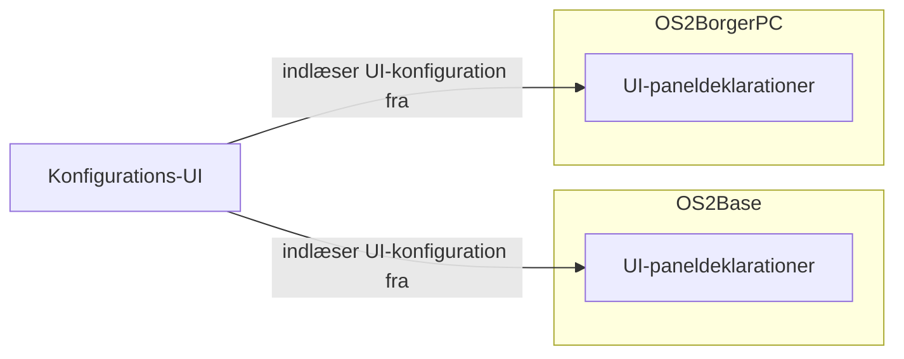
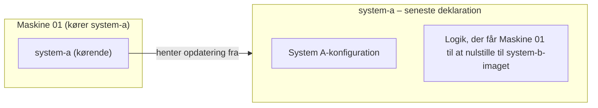

# Løsningskandidater

Skitser til løsningskandidater for de problemtyper, der er identificeret i afsnittet "Risici ved standardiserede deklarationer" i hoveddokumentet.

## Begrænsede systemer vs. slutbrugerbehov

Eksempel: Indskolings-PC hos Aarhus Kommune:

For at undgå at ende med én deklaration pr. maskine:

### Tilføjelsesmønster

Administratoren kan tillade slutbrugeren at _udvide_ sit eksisterende softwaresystem. Slutbrugeren må imidlertid aldrig _fjerne_ eller _ændre_ dele af den konfigurationsafstemte tilstand.

Eksempel: Bruger: "Jeg vil gerne kunne installere software, der er relevant for mit brugsscenarie."
Løsning: Stil en liste over apps, der må installeres på systemet, til rådighed. Disse apps må ikke ændre nogen af de parametre, som administratoren er afhængig af (eksisterende sandbox-løsninger kan muliggøre dette).

### Referencemønster

Et andet eksempel: Bruger: "Jeg vil gerne kunne bruge den rigtige printer på mit kontor."
Løsning: Gør systemet uafhængigt af, hvilken specifik printer en bruger anvender. Hver maskine har adgang til en lang liste af printere, og adgangsrettigheder håndhæves på printer- eller netværksniveau.

## Hvordan ved vi, hvilken tilstand flåden er i?

- Hver maskine stiller standardiserede observationsdata til rådighed.
- Et centralt observationssystem indsamler alle disse data.
- Observationsdata konverteres til et standardiseret format.

Informationsflowet bliver således:

Påkrævede maskinkomponenter:

- Maskinedataindsamler (en komponent, der indsamler maskinadfærd, konverterer den til det standardiserede brugsdataformat og sender den til observationssystemet)
- Opdateringstjekker (en komponent, der regelmæssigt undersøger, om der findes nye image-patches, downloader dem og anvender dem på maskinen)

## Problemfri konfigurationsoplevelse

- Konfigurationsstyring er baseret på en eksisterende VCS-løsning som Git. **Hvorfor?** Det giver os sporbar historik, tilbagerulning samt gennemgang og godkendelse af ændringer uden yderligere omkostninger.
- Som en del af OS2fri oprettes et tyndt lag oven på Git, der gør konfiguration lettere for lokale administratorer.
- OS2Base leverer UI-logikken til konfigurationsgrænsefladen og undersøger det rette visuelle og oplevelsesmæssige designsprog.
- UI-logikken konverterer et standardiseret mellemformat til en brugergrænseflade.
- De enkelte OS2fri-produkter eksponerer konfigurationselementer i det standardiserede mellemformat.

Sådan sikres et problemfrit konfigurations-UI på tværs af projektgrænser:

## Fjernstyrede ændringer af systemkonfiguration

**Vigtigt:** Hvis kravet om "fjernstyring" ikke er lige så strengt, er andre designs bedre end dette.

De konkrete ændringsmekanismer skal undersøges på forhånd, hvorefter logikken for disse ændringer tilføjes systemet.

Fordi et bestemt system kun henter den konfiguration, som andre systemer også henter, kan problemerne løses således:

- De enkelte ændringsmekanismer er forudkonfigureret i imaget.
- Ved hver image-opdatering downloader alle maskiner en liste, der indeholder ID'erne på de maskiner, som ændringen skal anvendes på.
- Det betyder, at hver maskine har en unik og uforanderlig identifikation.

Maskinspecifikke ændringer flytter kun maskinen til den tilstand, der er defineret af en kendt, godkendt image stream.
