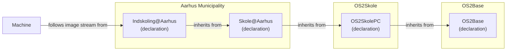
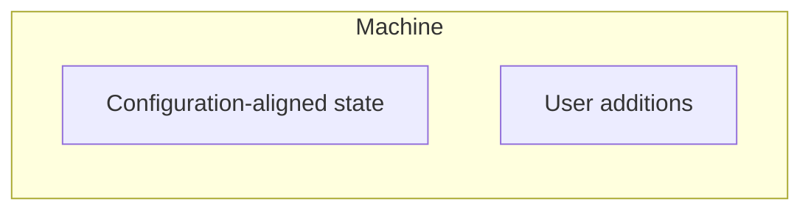
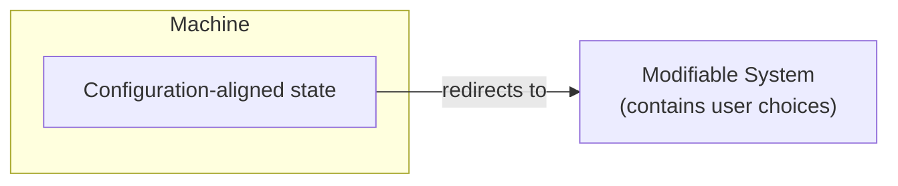
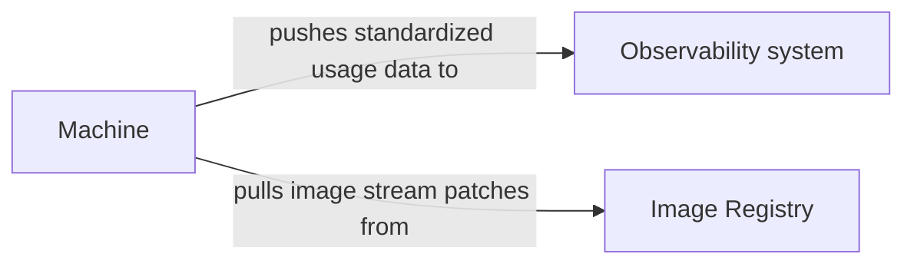
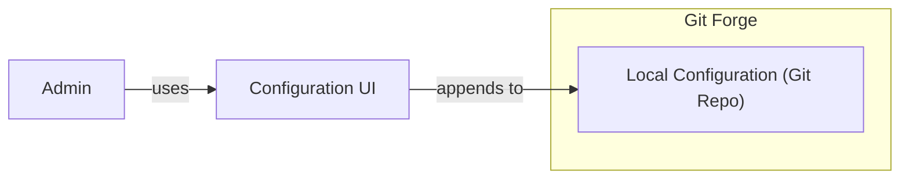
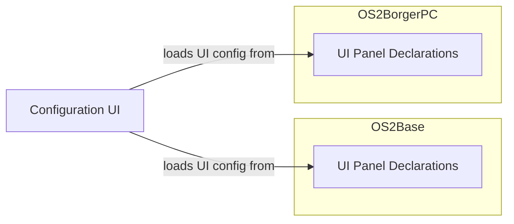
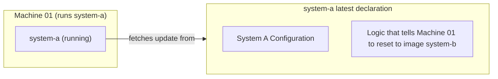

# Solution Candidates

Solution candidate sketches for the problem types identified in the "Standardized Declarations Risks" section of the main document.

## Restricted Systems vs. End-user Needs

Example: Early-years school PC at Aarhus Municipality:

To avoid ending up with one declaration per machine:

### Addition Pattern

The administrator may allow the end user to _extend_ their existing software system. However, the end user is never allowed to _remove_ or _modify_ parts of the configuration-aligned state.

For example: User: "I want to be able to install software that is relevant to my use case."
Solution: Provide a list of applications that may be installed on the system. These applications must not change any of the parameters on which the administrator relies (existing sandboxing solutions can provide this).

### Reference Pattern

Another example: User: "I want to be able to use the correct printer at my office."
Solution: Make the system agnostic about the specific printer used by a user. Every machine has access to a long list of printers, with permissions enforced at the printer or network level.

## How Do We Know the State of the Fleet?

- Each machine exposes standardized observability data.
- A central observability system collects all this data.
- Observability data is converted into a standardized format.

The information flow then becomes:

Required machine components:

- Machine Data Collector (a component that collects machine behavior, converts it into the standardized usage-data format, and sends it to the observability system)
- Update Checker (a component that regularly checks for new image patches, downloads them, and applies them to the machine)

## Seamless Configuration Experience

- Configuration management is based on an existing VCS solution such as Git. **Why?** This gives us traceable history, rollback, and review and approval of changes at no additional cost.
- As part of OS2fri, a thin layer is created on top of Git to make configuration easier for local administrators.
- OS2Base provides the UI logic for the configuration interface and investigates the appropriate visual and user-experience design language.
- The UI logic converts a standardized intermediate format into a UI.
- Individual OS2fri products expose configuration items in the standardized intermediate format.

Making the Configuration UI seamless across project boundaries:

## Remote System Configuration Changes

**Important:** If the "remote" requirement is less strict, other designs are preferable to this one.

Specific manipulation pathways must be investigated in advance, after which logic for those manipulations is added to the system.

Because a particular system only ever retrieves the same configuration as other systems, the problems can be solved as follows:

- Specific manipulation paths are preconfigured in the image.
- With every image update, all machines download a list containing the IDs of the machines to which the manipulation must be applied.
- This means that every machine has a unique, immutable identifier.

Changes to individual machines only move the machine to the state of a known, approved image stream.
